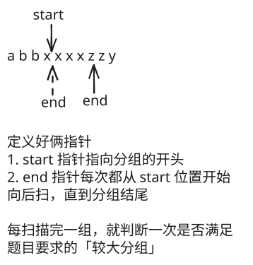

## 1. 📝 题目描述

- [leetcode](https://leetcode.cn/problems/positions-of-large-groups/)

---

- 在一个由小写字母构成的字符串 `s` 中，包含由一些连续的相同字符所构成的分组。
- 例如，在字符串 `s = "abbxxxxzyy"` 中，就含有 `"a"`, `"bb"`, `"xxxx"`, `"z"` 和 `"yy"` 这样的一些分组。
- 分组可以用区间 `[start, end]` 表示，其中 `start` 和 `end` 分别表示该分组的起始和终止位置的下标。上例中的 `"xxxx"` 分组用区间表示为 `[3,6]`。
- 我们称所有包含大于或等于三个连续字符的分组为 较大分组。
- 找到每一个 较大分组 的区间，按起始位置下标递增顺序排序后，返回结果。

---

示例 1：

```txt
输入：s = "abbxxxxzzy"
输出：[[3,6]]
解释："xxxx" 是一个起始于 3 且终止于 6 的较大分组。
```

---

示例 2：

```txt
输入：s = "abc"
输出：[]
解释："a","b" 和 "c" 均不是符合要求的较大分组。
```

---

示例 3：

```txt
输入：s = "abcdddeeeeaabbbcd"
输出：[[3,5],[6,9],[12,14]]
解释：较大分组为 "ddd", "eeee" 和 "bbb"
```

---

示例 4：

```txt
输入：s = "aba"
输出：[]
```

---

提示：

- `1 <= s.length <= 1000`
- `s` 仅含小写英文字母

## 2. 🎯 s.1 - 双指针



::: code-group

```js [1.js]
/**
 * @param {string} s
 * @return {number[][]}
 */
var largeGroupPositions = function (s) {
  const result = []
  let start = 0

  for (let i = 0; i <= s.length; i++) {
    // 当到达字符串末尾或字符发生变化时，检查当前分组
    if (i === s.length || s[i] !== s[start]) {
      // 如果当前分组长度大于等于3，则记录位置
      if (i - start >= 3) {
        result.push([start, i - 1])
      }
      start = i // 更新下一个分组的起始位置
    }
  }

  return result
}
```

```js [2.js]
/**
 * @param {string} s
 * @return {number[][]}
 */
var largeGroupPositions = function (s) {
  const result = []
  let i = 0

  while (i < s.length) {
    const j = i
    // 找到当前分组的结束位置
    while (i < s.length && s[i] === s[j]) {
      i++
    }
    // 如果当前分组长度大于等于3，则记录位置
    if (i - j >= 3) {
      result.push([j, i - 1])
    }
  }

  return result
}
```

:::

- 时间复杂度：$O(n)$，其中 n 是字符串的长度，只需要遍历一次字符串
- 空间复杂度：$O(1)$，不考虑结果数组的话，只使用了常数个额外变量
- `1.js` 和 `2.js` 是双指针逻辑实现的两种不同写法。
