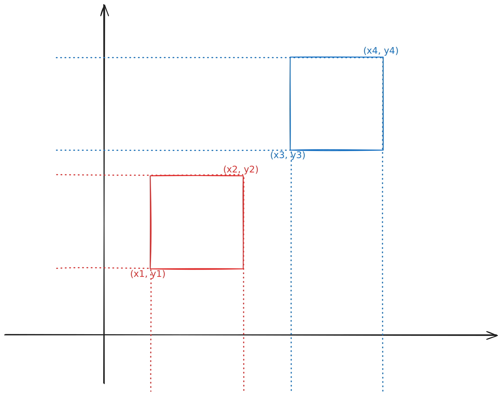
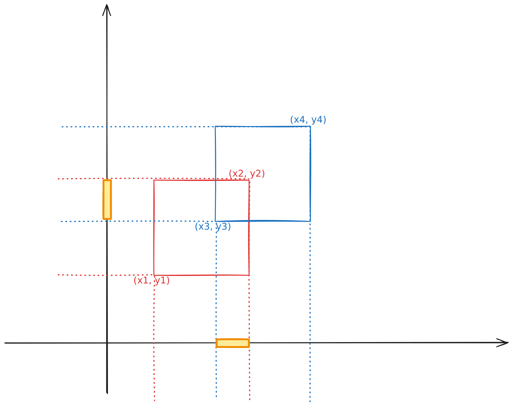

# [0836. 矩形重叠【简单】](https://github.com/tnotesjs/TNotes.leetcode/tree/main/notes/0836.%20%E7%9F%A9%E5%BD%A2%E9%87%8D%E5%8F%A0%E3%80%90%E7%AE%80%E5%8D%95%E3%80%91)

<!-- region:toc -->

- [1. 📝 题目描述](#1--题目描述)
- [2. 🫧 评价](#2--评价)
- [3. 🎯 s.1 - 投影法](#3--s1---投影法)
- [4. 🎯 s.2 - 排除法](#4--s2---排除法)

<!-- endregion:toc -->

## 1. 📝 题目描述

- [leetcode](https://leetcode.cn/problems/rectangle-overlap/)

---

- 矩形以列表 `[x1, y1, x2, y2]` 的形式表示，其中 `(x1, y1)` 为左下角的坐标，`(x2, y2)` 是右上角的坐标。
- 矩形的上下边平行于 x 轴，左右边平行于 y 轴。
- 如果相交的面积为 正 ，则称两矩形重叠。
- 需要明确的是，只在角或边接触的两个矩形不构成重叠。
- 给出两个矩形 `rec1` 和 `rec2`。如果它们重叠，返回 `true`；否则，返回 `false`。

---

示例 1：

```txt
输入：rec1 = [0,0,2,2], rec2 = [1,1,3,3]
输出：true
```

示例 2：

```txt
输入：rec1 = [0,0,1,1], rec2 = [1,0,2,1]
输出：false
```

示例 3：

```txt
输入：rec1 = [0,0,1,1], rec2 = [2,2,3,3]
输出：false
```

---

提示：

- `rect1.length == 4`
- `rect2.length == 4`
- `-10^9 <= rec1[i], rec2[i] <= 10^9`
- `rec1` 和 `rec2` 表示一个面积不为零的有效矩形

## 2. 🫧 评价

- 涉及到坐标的题目，可以尝试将图给绘制出来再解答，这样会更加清晰。
- `s.1 - 投影法`、`s.2 - 排除法` 都是比较好的解法。

## 3. 🎯 s.1 - 投影法

::: swiper





:::

::: code-group

<<< ./solutions/1/1.js [js]

:::

- 时间复杂度：$O(1)$，只需要常数时间的计算
- 空间复杂度：$O(1)$，只使用了常数个额外变量
- 算法思路：
  - 通过投影到 x 轴和 y 轴来判断是否重叠，如果两个矩形重叠，那么可以推断出：
  - => 结论：它们在 x 轴和 y 轴上的投影都重叠。
  - => 判断依据：矩形 1（或矩形 2） 的右上角和矩形 2（或矩形 1） 的左下角相交。
  - => 具体实现：左下角的坐标应该取两矩形中的较大者，右上角的坐标应该取两矩形中的较小者，判断两个角是否都相交。

## 4. 🎯 s.2 - 排除法

::: code-group

<<< ./solutions/2/1.js [js]

:::

- 时间复杂度：$O(1)$，只需要常数时间的计算
- 空间复杂度：$O(1)$，只使用了常数个额外变量
- 算法思路：通过排除不重叠的情况来判断是否重叠。
