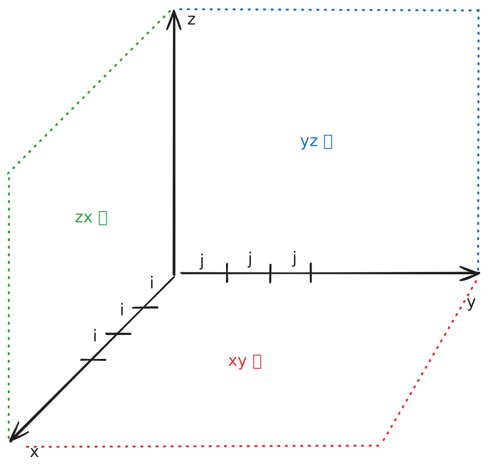

# [0883. 三维形体投影面积【简单】](https://github.com/tnotesjs/TNotes.leetcode/tree/main/notes/0883.%20%E4%B8%89%E7%BB%B4%E5%BD%A2%E4%BD%93%E6%8A%95%E5%BD%B1%E9%9D%A2%E7%A7%AF%E3%80%90%E7%AE%80%E5%8D%95%E3%80%91)

<!-- region:toc -->

- [1. 📝 题目描述](#1--题目描述)
- [2. 🎯 s.1 - 暴力解法](#2--s1---暴力解法)

<!-- endregion:toc -->

## 1. 📝 题目描述

- [leetcode](https://leetcode.cn/problems/projection-area-of-3d-shapes/)

在 `n x n` 的网格 `grid` 中，我们放置了一些与 x，y，z 三轴对齐的 `1 x 1 x 1` 立方体。

每个值 `v = grid[i][j]` 表示有一列 `v` 个正方体叠放在格子 `(i, j)` 上。

现在，我们查看这些立方体在 `xy` 、`yz` 和 `zx` 平面上的*投影*。

投影 就像影子，将 三维 形体映射到一个 二维 平面上。从顶部、前面和侧面看立方体时，我们会看到“影子”。

返回 _所有三个投影的总面积_。

---

- 示例 1：


```txt
输入：[[1,2],[3,4]]
输出：17
解释：这里有该形体在三个轴对齐平面上的三个投影(“阴影部分”)。
```

- 示例 2：

```txt
输入：grid = [[2]]
输出：5
```

- 示例 3：

```txt
输入：[[1,0],[0,2]]
输出：8
```

---

提示：

- `n == grid.length == grid[i].length`
- `1 <= n <= 50`
- `0 <= grid[i][j] <= 50`

## 2. 🎯 s.1 - 暴力解法



::: code-group

<<< ./solutions/1/1.js [js]

:::

- 时间复杂度：$O(n^2)$，其中 $n$ 是网格的边长，需要遍历整个网格一次
- 空间复杂度：$O(1)$，只使用了常数级别的额外空间
- 解题思路：
  1. xy 平面投影：统计所有非零高度的单元格数量
  2. yz 平面投影：从正面看 - 将 `grid[i][j]` 中的 `i` 固定，遍历 `j`，找到所有最大值求和；
  3. zx 平面投影：从侧面看 - 将 `grid[i][j]` 中的 `j` 固定，遍历 `i`，找到所有最大值求和；
- 提交结果：
  - 
