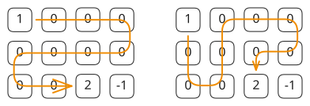
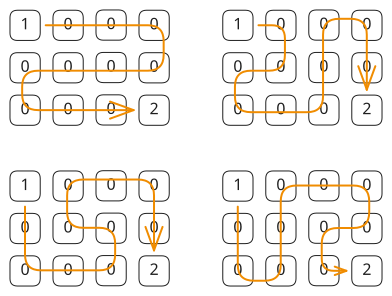

## 1. 📝 题目描述

- [leetcode](https://leetcode.cn/problems/unique-paths-iii/)

在二维网格 `grid` 上，有 4 种类型的方格：

- `1` 表示起始方格。且只有一个起始方格。
- `2` 表示结束方格，且只有一个结束方格。
- `0` 表示我们可以走过的空方格。
- `-1` 表示我们无法跨越的障碍。

返回在四个方向（上、下、左、右）上行走时，从起始方格到结束方格的不同路径的数目。

每一个无障碍方格都要通过一次，但是一条路径中不能重复通过同一个方格。

---

示例 1：

```txt
输入：[
  [1, 0, 0, 0],
  [0, 0, 0, 0],
  [0, 0, 2, -1]
]
输出：2
```

解释：

我们有以下两条路径：

1. `(0, 0), (0, 1), (0, 2), (0, 3), (1, 3), (1, 2), (1, 1), (1, 0), (2, 0), (2, 1), (2, 2)`
2. `(0, 0), (1, 0), (2, 0), (2, 1), (1, 1), (0, 1), (0, 2), (0, 3), (1, 3), (1, 2), (2, 2)`



---

示例 2：

```txt
输入：[
  [1, 0, 0, 0],
  [0, 0, 0, 0],
  [0, 0, 0, 2]
]
输出：4
```

解释：我们有以下四条路径：

1. `(0, 0), (0, 1), (0, 2), (0, 3), (1, 3), (1, 2), (1, 1), (1, 0), (2, 0), (2, 1), (2, 2), (2, 3)`
2. `(0, 0), (0, 1), (1, 1), (1, 0), (2, 0), (2, 1), (2, 2), (1, 2), (0, 2), (0, 3), (1, 3), (2, 3)`
3. `(0, 0), (1, 0), (2, 0), (2, 1), (2, 2), (1, 2), (1, 1), (0, 1), (0, 2), (0, 3), (1, 3), (2, 3)`
4. `(0, 0), (1, 0), (2, 0), (2, 1), (1, 1), (0, 1), (0, 2), (0, 3), (1, 3), (1, 2), (2, 2), (2, 3)`



---

示例 3：

```txt
输入：[
  [0, 1],
  [2, 0]
]
输出：0
```

解释：

没有一条路能完全穿过每一个空的方格一次。

请注意，起始和结束方格可以位于网格中的任意位置。

---

提示：

- `1 <= grid.length * grid[0].length <= 20`

## 2. 🎯 s.1 - 回溯

::: code-group

```c [c]
int directions[4][2] = {{0, 1}, {0, -1}, {1, 0}, {-1, 0}};
int rowCount;
int colCount;

int dfs(int** grid, int x, int y, int remaining) {
	if (grid[x][y] == 2) return remaining == 0 ? 1 : 0;

	int temp = grid[x][y];
	grid[x][y] = -1;
	int total = 0;

	for (int d = 0; d < 4; d++) {
		int nextX = x + directions[d][0];
		int nextY = y + directions[d][1];

		if (nextX < 0 || nextX >= rowCount || nextY < 0 || nextY >= colCount || grid[nextX][nextY] == -1) {
			continue;
		}

		int nextRemaining = grid[nextX][nextY] == 0 ? remaining - 1 : remaining;
		total += dfs(grid, nextX, nextY, nextRemaining);
	}

	grid[x][y] = temp;
	return total;
}

int uniquePathsIII(int** grid, int gridSize, int* gridColSize) {
	rowCount = gridSize;
	colCount = gridColSize[0];

	int startX = 0;
	int startY = 0;
	int emptyCount = 0;

	for (int i = 0; i < rowCount; i++) {
		for (int j = 0; j < colCount; j++) {
			if (grid[i][j] == 0) {
				emptyCount++;
			} else if (grid[i][j] == 1) {
				startX = i;
				startY = j;
			}
		}
	}

	return dfs(grid, startX, startY, emptyCount);
}
```

```js [js]
/**
 * @param {number[][]} grid
 * @return {number}
 */
var uniquePathsIII = function (grid) {
  const m = grid.length
  const n = grid[0].length
  let startX = 0,
    startY = 0,
    emptyCount = 0

  // 统计空方格数量并找到起点
  for (let i = 0; i < m; i++) {
    for (let j = 0; j < n; j++) {
      if (grid[i][j] === 0) {
        emptyCount++
      } else if (grid[i][j] === 1) {
        startX = i
        startY = j
      }
    }
  }

  const directions = [
    [0, 1],
    [0, -1],
    [1, 0],
    [-1, 0],
  ]
  let count = 0

  const dfs = (x, y, remaining) => {
    // 到达终点
    if (grid[x][y] === 2) {
      // 检查是否经过了所有空方格
      if (remaining === 0) {
        count++
      }
      return
    }

    // 标记当前位置为已访问
    const temp = grid[x][y]
    grid[x][y] = -1

    // 尝试四个方向
    for (const [dx, dy] of directions) {
      const nx = x + dx
      const ny = y + dy

      // 检查边界和是否可访问
      if (nx >= 0 && nx < m && ny >= 0 && ny < n && grid[nx][ny] !== -1) {
        // 如果是空方格，减少剩余计数
        const nextRemaining = grid[nx][ny] === 0 ? remaining - 1 : remaining
        dfs(nx, ny, nextRemaining)
      }
    }

    // 回溯：恢复当前位置
    grid[x][y] = temp
  }

  dfs(startX, startY, emptyCount)
  return count
}
```

```py [py]
class Solution:
	def uniquePathsIII(self, grid: List[List[int]]) -> int:
		m, n = len(grid), len(grid[0])
		start_x = 0
		start_y = 0
		empty_count = 0

		for i in range(m):
			for j in range(n):
				if grid[i][j] == 0:
					empty_count += 1
				elif grid[i][j] == 1:
					start_x = i
					start_y = j

		directions = ((0, 1), (0, -1), (1, 0), (-1, 0))

		def dfs(x: int, y: int, remaining: int) -> int:
			if grid[x][y] == 2:
				return 1 if remaining == 0 else 0

			temp = grid[x][y]
			grid[x][y] = -1
			total = 0

			for dx, dy in directions:
				next_x = x + dx
				next_y = y + dy

				if 0 <= next_x < m and 0 <= next_y < n and grid[next_x][next_y] != -1:
					next_remaining = remaining - 1 if grid[next_x][next_y] == 0 else remaining
					total += dfs(next_x, next_y, next_remaining)

			grid[x][y] = temp
			return total

		return dfs(start_x, start_y, empty_count)
```

:::

- 时间复杂度：$O(4^{m \times n})$，其中 m 和 n 是网格的行数和列数，最坏情况下需要探索所有可能的路径
- 空间复杂度：$O(m \times n)$，递归栈的深度最多为网格中所有方格的数量

算法思路：

- 预处理：统计空方格数量（值为 0 的格子）并找到起点位置（值为 1 的格子）
- 回溯框架：从起点开始深度优先搜索，尝试四个方向移动，标记已访问的格子为 -1
- 终止条件：到达终点（值为 2 的格子）时，检查剩余空方格数量是否为 0，是则找到一条有效路径
- 剩余计数：维护 `remaining` 变量记录还需经过的空方格数量，每经过一个空方格减 1
- 状态恢复：回溯时恢复当前格子的原始值，允许其他路径访问
- 路径统计：每找到一条满足条件的路径，计数器加 1
