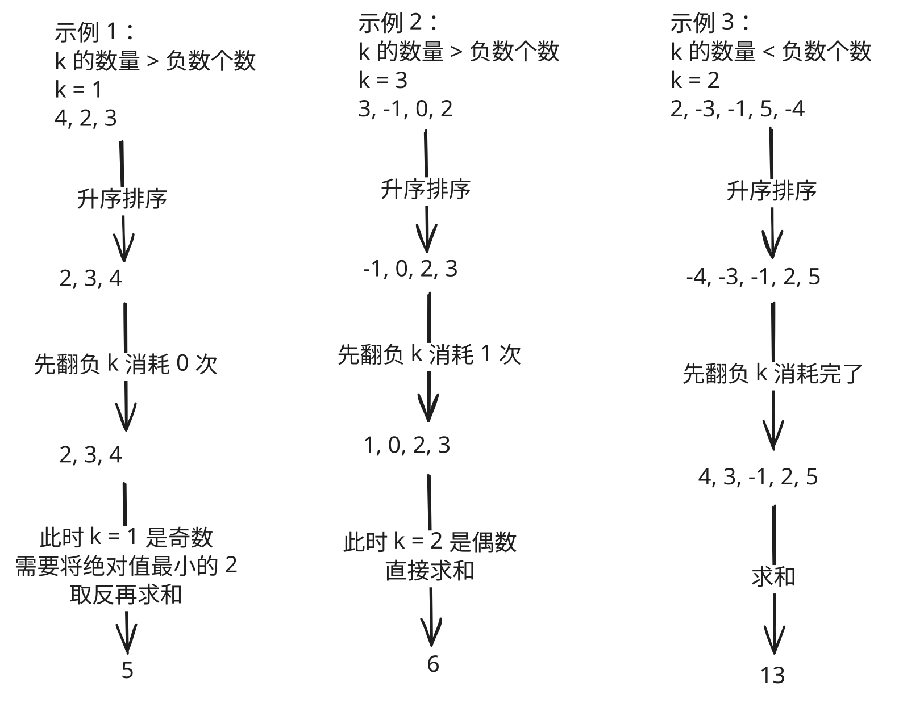

## 1. 📝 题目描述

- [leetcode](https://leetcode.cn/problems/maximize-sum-of-array-after-k-negations/)

给你一个整数数组 `nums` 和一个整数 `k`，按以下方法修改该数组：

- 选择某个下标 `i` 并将 `nums[i]` 替换为 `-nums[i]`。

重复这个过程恰好 `k` 次。可以多次选择同一个下标 `i`。

以这种方式修改数组后，返回数组可能的最大和。

---

示例 1：

```txt
输入：nums = [4,2,3], k = 1
输出：5
解释：选择下标 1，nums 变为 [4,-2,3]。
```

---

示例 2：

```txt
输入：nums = [3,-1,0,2], k = 3
输出：6
解释：选择下标 (1, 2, 2)，nums 变为 [3,1,0,2]。
```

---

示例 3：

```txt
输入：nums = [2,-3,-1,5,-4], k = 2
输出：13
解释：选择下标 (1, 4)，nums 变为 [2,3,-1,5,4]。
```

---

提示：

- `1 <= nums.length <= 10^4`
- `-100 <= nums[i] <= 100`
- `1 <= k <= 10^4`

## 2. 🎯 s.1 - 贪心（先翻负，再处理余数）

::: swiper



:::

::: code-group

```js [js]
/**
 * @param {number[]} nums
 * @param {number} k
 * @return {number}
 */
var largestSumAfterKNegations = function (nums, k) {
  // 升序
  nums.sort((a, b) => a - b)

  let sum = 0
  let minAbs = Infinity
  for (let i = 0; i < nums.length; i++) {
    // 优先把负数取反，消耗一次操作
    if (nums[i] < 0 && k > 0) {
      nums[i] = -nums[i]
      k--
    }
    sum += nums[i]
    // 记录绝对值最小值，便于最后奇数次余量再取反
    if (Math.abs(nums[i]) < minAbs) minAbs = Math.abs(nums[i])
  }
  // 若还剩奇数次操作，则取反绝对值最小的数
  if (k % 2 === 1) sum -= 2 * minAbs
  return sum
}
```

:::

- 时间复杂度：$O(n \log n)$
- 空间复杂度：$O(1)$

算法思路：

- 贪心思想：k 表示能够将一个数取反的次数，要让 k 的效益最大化，k 应该优先用于对最小的负数取反。
- 情况 1：k <= 负数个数 => k 一定被负数消耗完
- 情况 2：k > 负数个数 => k 可以先将所有的负数变为正数，且 k 有剩余
  - k = 偶数 => 忽略即可，随便将一个数同时反转 k 次，这个数保持不变
  - k = 奇数 => 将绝对值最小的数改为负数影响最小
