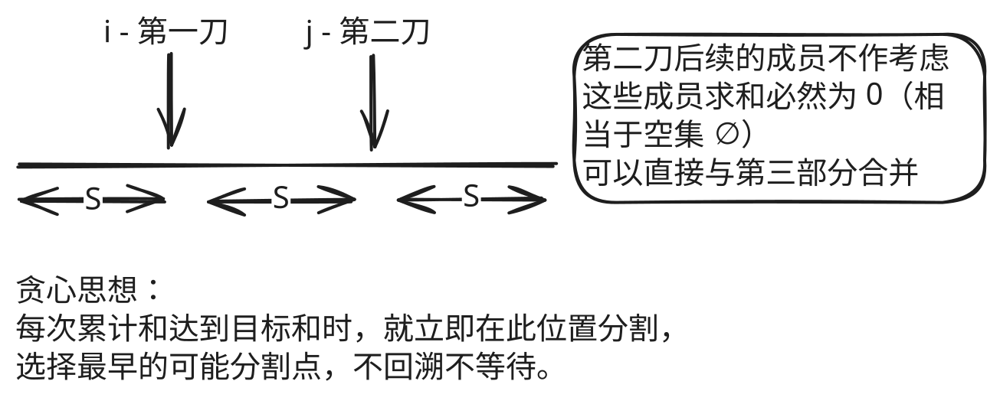

## 1. 📝 题目描述

- [leetcode](https://leetcode.cn/problems/partition-array-into-three-parts-with-equal-sum/)

给你一个整数数组 `arr`，只有可以将其划分为三个和相等的非空部分时才返回 `true`，否则返回 `false`。

形式上，如果可以找出索引 `i + 1 < j` 且满足 `(arr[0] + arr[1] + ... + arr[i] == arr[i + 1] + arr[i + 2] + ... + arr[j - 1] == arr[j] + arr[j + 1] + ... + arr[arr.length - 1])` 就可以将数组三等分。

---

示例 1：

```txt
输入：arr = [0,2,1,-6,6,-7,9,1,2,0,1]
输出：true
解释：0 + 2 + 1 = -6 + 6 - 7 + 9 + 1 = 2 + 0 + 1
```

示例 2：

```txt
输入：arr = [0,2,1,-6,6,7,9,-1,2,0,1]
输出：false
```

示例 3：

```txt
输入：arr = [3,3,6,5,-2,2,5,1,-9,4]
输出：true
解释：3 + 3 = 6 = 5 - 2 + 2 + 5 + 1 - 9 + 4
```

---

提示：

- `3 <= arr.length <= 5 * 10^4`
- `-10^4 <= arr[i] <= 10^4`

## 2. 🎯 s.1 - 贪心遍历



::: code-group

```js [js]
/**
 * @param {number[]} arr
 * @return {boolean}
 */
var canThreePartsEqualSum = function (arr) {
  // 计算数组总和
  const totalSum = arr.reduce((sum, num) => sum + num, 0)

  // 如果总和不能被 3 整除，无法分成三等分，直接返回 false
  if (totalSum % 3 !== 0) {
    return false
  }

  const targetSum = totalSum / 3
  let currentSum = 0
  let count = 0 // 和为 targetSum 的连续片段（子数组）的个数

  // 遍历数组，寻找和为 targetSum 的子数组个数
  for (let i = 0; i < arr.length; i++) {
    currentSum += arr[i]

    // 如果当前累计和等于目标和
    if (currentSum === targetSum) {
      if (++count === 3) return true
      // 或者：
      // if (++count === 2 && i !== arr.length - 1) return true
      currentSum = 0 // 重置累计和，开始寻找下一个部分
    }
  }

  return false
}

/* 
提交时间：2026.01.05
执行用时分布 0 ms 击败 100.00%
消耗内存分布 57.88 MB 击败 100.00%
*/
```

:::

- 时间复杂度：$O(n)$，其中 $n$ 为数组长度，需遍历数组计算总和并寻找等分点
- 空间复杂度：$O(1)$，仅使用了常数个变量

算法思路：

- 计算总和 `totalSum`，若不能被 3 整除则返回 `false`
- 遍历数组累加 `currentSum`，每当达到 `targetSum = totalSum / 3` 时计数器 `count` 加 1 并重置
- 若最终 `count >= 3` 则说明可以分为三个和相等的部分
