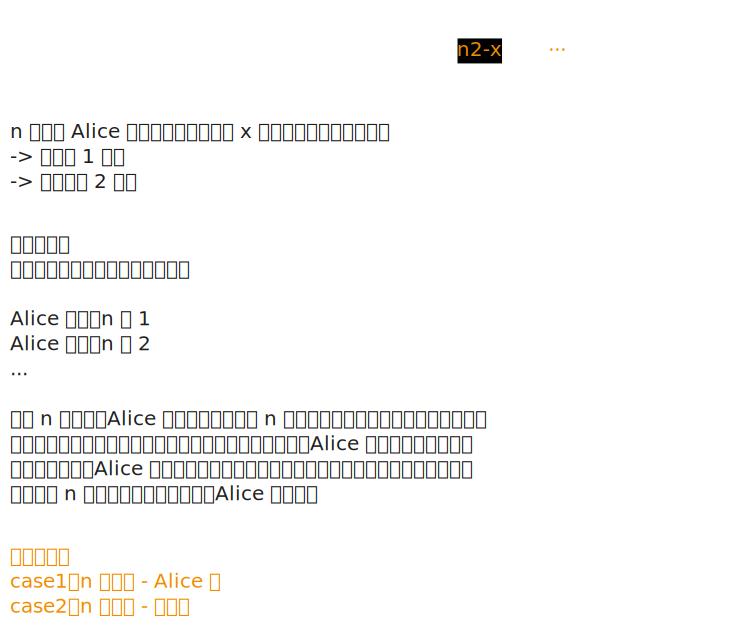

# [1025. 除数博弈【简单】](https://github.com/tnotesjs/TNotes.leetcode/tree/main/notes/1025.%20%E9%99%A4%E6%95%B0%E5%8D%9A%E5%BC%88%E3%80%90%E7%AE%80%E5%8D%95%E3%80%91)

<!-- region:toc -->

- [1. 📝 题目描述](#1--题目描述)
- [2. 🎯 s.1 - 数学归纳（偶数必胜）](#2--s1---数学归纳偶数必胜)

<!-- endregion:toc -->

## 1. 📝 题目描述

- [leetcode](https://leetcode.cn/problems/divisor-game/)

爱丽丝和鲍勃一起玩游戏，他们轮流行动。爱丽丝先手开局。

最初，黑板上有一个数字 `n`。在每个玩家的回合，玩家需要执行以下操作：

- 选出任一 `x`，满足 `0 < x < n` 且 `n % x == 0`。
- 用 `n - x` 替换黑板上的数字 `n`。

如果玩家无法执行这些操作，就会输掉游戏。

只有在爱丽丝在游戏中取得胜利时才返回 `true`。假设两个玩家都以最佳状态参与游戏。

---

示例 1：

```txt
输入：n = 2
输出：true

解释：
爱丽丝选择 1，鲍勃无法进行操作。
```

---

示例 2：

```txt
输入：n = 3
输出：false

解释：
爱丽丝选择 1，鲍勃也选择 1，然后爱丽丝无法进行操作。
```

---

提示：

- `1 <= n <= 1000`

## 2. 🎯 s.1 - 数学归纳（偶数必胜）



::: code-group

<<< ./solutions/1/1.js [js]

:::

- 时间复杂度：$O(1)$，只需判断奇偶性
- 空间复杂度：$O(1)$，只使用了常数级别的额外空间

解题思路：

- 基本情况：
  - 当 `n = 1`：先手无法选择任何满足 `0 < x < 1` 的整数，输掉比赛，结果为 `false`
  - 当 `n = 2`：先手可以选择 `x = 1`，使得 `n = n - 1 = 1`，后手无法操作，先手赢，结果为 `true`
  - ...
  - 结论：给对方留下 `1` 就能赢 -> 谁先走到 `2` 谁赢
- 归纳分析：
  - 如果 `n` 是偶数：Alice 一定可以给对手留下奇数
    - 因为 `n` 至少有一个奇因数（可能是 1）或至少能减去 1 使其变为奇数
    - 先手总可以选一个合适的 `x`（可能是 1 或某个因数），使 `n - x` 变为奇数给后手
  - 如果 `n` 是奇数：Alice 一定只能给对手留下偶数
    - 因为奇数的所有因数都是奇数，所以 `n - x` 必为偶数
    - 先手只能把偶数给后手，后手面对偶数必赢，所以先手输
- 结论：
  - 当 `n` 是偶数时，Alice 获胜（`true`）
  - 当 `n` 是奇数时，Alice 失败（`false`）
