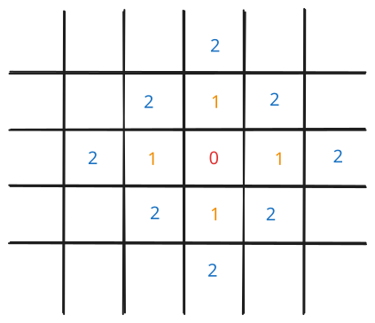

## 1. 📝 题目描述

- [leetcode](https://leetcode.cn/problems/matrix-cells-in-distance-order/)

给定四个整数 `rows` , `cols` , `rCenter` 和 `cCenter`。有一个 `rows x cols` 的矩阵，你在单元格上的坐标是 `(rCenter, cCenter)`。

返回矩阵中的所有单元格的坐标，并按与 `(rCenter, cCenter)` 的距离从最小到最大的顺序排。你可以按任何满足此条件的顺序返回答案。

单元格`(r1, c1)` 和 `(r2, c2)` 之间的距离为 `|r1 - r2| + |c1 - c2|`。

---

示例 1：

```txt
输入：rows = 1, cols = 2, rCenter = 0, cCenter = 0
输出：[[0,0],[0,1]]

解释：
从 (r0, c0) 到其他单元格的距离为：[0,1]
```

---

示例 2：

```txt
输入：rows = 2, cols = 2, rCenter = 0, cCenter = 1
输出：[[0,1],[0,0],[1,1],[1,0]]

解释：
从 (r0, c0) 到其他单元格的距离为：[0,1,1,2]
[[0,1],[1,1],[0,0],[1,0]] 也会被视作正确答案
```

---

示例 3：

```txt
输入：rows = 2, cols = 3, rCenter = 1, cCenter = 2
输出：[[1,2],[0,2],[1,1],[0,1],[1,0],[0,0]]

解释：
从 (r0, c0) 到其他单元格的距离为：[0,1,1,2,2,3]
其他满足题目要求的答案也会被视为正确，例如 [[1,2],[1,1],[0,2],[1,0],[0,1],[0,0]]
```

---

提示：

- `1 <= rows, cols <= 100`
- `0 <= rCenter < rows`
- `0 <= cCenter < cols`

## 2. 🎯 s.1 - 暴力解法

::: code-group

```js [js]
/**
 * @param {number} rows
 * @param {number} cols
 * @param {number} rCenter
 * @param {number} cCenter
 * @return {number[][]}
 */
var allCellsDistOrder = function (rows, cols, rCenter, cCenter) {
  const result = []

  // 生成所有坐标
  for (let i = 0; i < rows; i++) {
    for (let j = 0; j < cols; j++) {
      result.push([i, j])
    }
  }

  // 按曼哈顿距离排序
  result.sort((a, b) => {
    const distA = Math.abs(a[0] - rCenter) + Math.abs(a[1] - cCenter)
    const distB = Math.abs(b[0] - rCenter) + Math.abs(b[1] - cCenter)
    return distA - distB
  })

  return result
}
```

:::

- 时间复杂度：$O(RC \log (RC))$，其中 R 和 C 分别是矩阵的行数和列数，枚举所有坐标需要 $O(RC)$，排序需要 $O(RC \log (RC))$
- 空间复杂度：$O(RC)$，需要存储所有坐标

算法思路：

- 遍历矩阵的所有单元格，将每个坐标 `[r, c]` 存入结果数组
- 根据曼哈顿距离公式 $|r - rCenter| + |c - cCenter|$ 对结果数组进行排序
- 曼哈顿距离小的坐标排在前面，距离相同的顺序任意

## 3. 🎯 s.2 - BFS



::: code-group

```js [js]
/**
 * @param {number} rows
 * @param {number} cols
 * @param {number} rCenter
 * @param {number} cCenter
 * @return {number[][]}
 */
var allCellsDistOrder = function (rows, cols, rCenter, cCenter) {
  const result = []

  // 记录访问过的点
  const visited = Array.from({ length: rows }, () => Array(cols).fill(false))

  // 扩撒起点
  const queue = [[rCenter, cCenter]]
  visited[rCenter][cCenter] = true

  // 每个点的 4 个扩散方向
  const dirs = [
    [0, 1],
    [0, -1],
    [1, 0],
    [-1, 0],
  ]

  while (queue.length > 0) {
    const [r, c] = queue.shift()
    result.push([r, c])

    // 遍历所有未访问过的点
    for (const [dr, dc] of dirs) {
      const nr = r + dr
      const nc = c + dc

      if (nr >= 0 && nr < rows && nc >= 0 && nc < cols && !visited[nr][nc]) {
        visited[nr][nc] = true
        queue.push([nr, nc])
      }
    }
  }

  return result
}
```

:::

- 时间复杂度：$O(RC)$，其中 R 和 C 分别是矩阵的行数和列数，每个单元格只访问一次
- 空间复杂度：$O(RC)$，需要使用队列和访问标记数组

算法思路：

- 从中心点 `(rCenter, cCenter)` 开始进行广度优先搜索（BFS）
- 使用队列存储待访问的坐标，使用二维数组标记已访问的单元格
- 每次从队列中取出一个坐标，将其加入结果数组，然后向四个方向扩展
- BFS 的特性保证了先访问的单元格距离中心点更近，因此结果自然按距离排序
