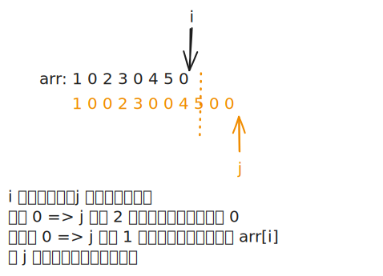

# [1089. 复写零【简单】](https://github.com/tnotesjs/TNotes.leetcode/tree/main/notes/1089.%20%E5%A4%8D%E5%86%99%E9%9B%B6%E3%80%90%E7%AE%80%E5%8D%95%E3%80%91)

<!-- region:toc -->

- [1. 📝 题目描述](#1--题目描述)
- [2. 🎯 s.1 - 双指针（末尾写入）](#2--s1---双指针末尾写入)

<!-- endregion:toc -->

## 1. 📝 题目描述

- [leetcode](https://leetcode.cn/problems/duplicate-zeros/)

给你一个长度固定的整数数组 `arr`，请你将该数组中出现的每个零都复写一遍，并将其余的元素向右平移。

注意：请不要在超过该数组长度的位置写入元素。请对输入的数组就地进行上述修改，不要从函数返回任何东西。

---

示例 1：

```txt
输入：arr = [1,0,2,3,0,4,5,0]
输出：[1,0,0,2,3,0,0,4]

解释：
调用函数后，输入的数组将被修改为：[1,0,0,2,3,0,0,4]
```

---

示例 2：

```txt
输入：arr = [1,2,3]
输出：[1,2,3]

解释：
调用函数后，输入的数组将被修改为：[1,2,3]
```

---

提示：

- `1 <= arr.length <= 10^4`
- `0 <= arr[i] <= 9`

## 2. 🎯 s.1 - 双指针（末尾写入）



::: code-group

<<< ./solutions/1/1.js [js]

:::

- 时间复杂度：$O(n)$，其中 $n$ 为数组长度，需先后遍历数组进行计数与移动
- 空间复杂度：$O(1)$，直接在输入数组上修改，不使用额外空间

算法思路：

- 统计数组中零的总数，计算复写后的虚拟总长度
- 从后向前遍历数组，根据虚拟索引将元素移动到最终位置
- 若当前元素为零，则连续进行两次写入操作并跳过越界位置
