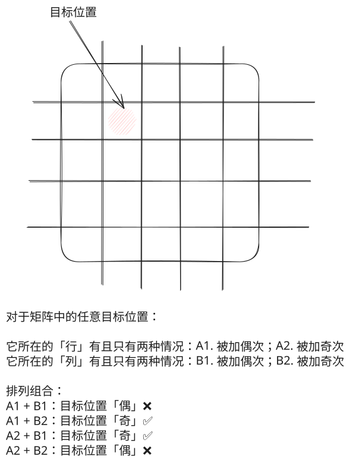

## 1. 📝 题目描述

- [leetcode](https://leetcode.cn/problems/cells-with-odd-values-in-a-matrix/)

给你一个 `m x n` 的矩阵，最开始的时候，每个单元格中的值都是 `0`。

另有一个二维索引数组 `indices`，`indices[i] = [ri, ci]` 指向矩阵中的某个位置，其中 `ri` 和 `ci` 分别表示指定的行和列（从 `0` 开始编号）。

对 `indices[i]` 所指向的每个位置，应同时执行下述增量操作：

1. `ri` 行上的所有单元格，加 `1`。
2. `ci` 列上的所有单元格，加 `1`。

给你 `m`、`n` 和 `indices`。请你在执行完所有 `indices` 指定的增量操作后，返回矩阵中奇数值单元格的数目。

---

示例 1：


```txt
输入：m = 2, n = 3, indices = [[0,1],[1,1]]
输出：6
```

解释：

- 最开始的矩阵是 `[[0, 0, 0],[0, 0, 0]]`。
- 第一次增量操作后得到 `[[1, 2, 1],[0, 1, 0]]`。
- 最后的矩阵是 `[[1, 3, 1],[1, 3, 1]]`，里面有 6 个奇数。

---

示例 2：


```txt
输入：m = 2, n = 2, indices = [[1,1],[0,0]]
输出：0
```

解释：最后的矩阵是 `[[2, 2],[2, 2]]`，里面没有奇数。

---

提示：

- `1 <= m, n <= 50`
- `1 <= indices.length <= 100`
- `0 <= ri < m`
- `0 <= ci < n`

---

进阶：你可以设计一个时间复杂度为 `O(n + m + indices.length)` 且仅用 `O(n + m)` 额外空间的算法来解决此问题吗？

## 2. 🎯 s.1 - 行列计数



::: code-group

```js [js]
/**
 * @param {number} m
 * @param {number} n
 * @param {number[][]} indices
 * @return {number}
 */
var oddCells = function (m, n, indices) {
  // 记录每行和每列被增加的次数
  const row = new Array(m).fill(0)
  const col = new Array(n).fill(0)
  for (const [r, c] of indices) {
    row[r] += 1
    col[c] += 1
  }

  // 统计奇数行和奇数列的数量
  let oddRows = 0
  for (const v of row) if (v % 2 === 1) oddRows += 1
  let oddCols = 0
  for (const v of col) if (v % 2 === 1) oddCols += 1

  // 计算奇数单元格的数量
  return (
    oddRows * (n - oddCols) + // 奇行配偶列
    oddCols * (m - oddRows) // 奇列配偶行
  )
}
```

:::

- 时间复杂度：$O(m + n + K)$，$K$ 为操作次数
- 空间复杂度：$O(m + n)$，存行列计数

算法思路：

- 维护行、列计数数组，遍历 `indices` 将对应行列加一
- 行列的奇偶操作次数决定单元格奇偶：奇行配偶列、偶行配奇列为奇数
