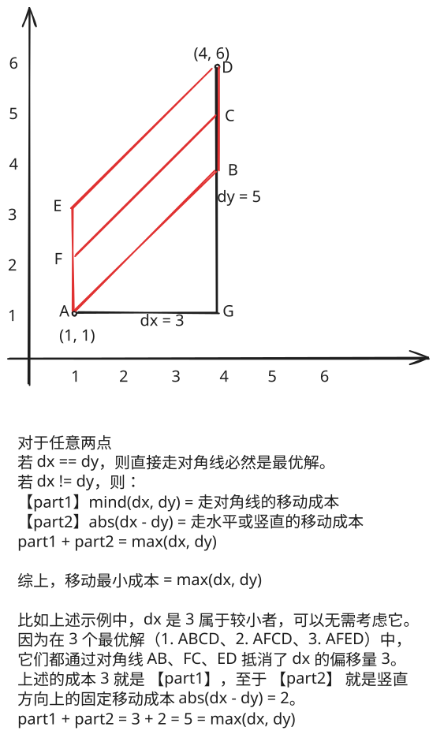

## 1. 📝 题目描述

- [leetcode](https://leetcode.cn/problems/minimum-time-visiting-all-points/)

平面上有 `n` 个点，点的位置用整数坐标表示 `points[i] = [xi, yi]`。请你计算访问所有这些点需要的最小时间（以秒为单位）。

你需要按照下面的规则在平面上移动：

- 每一秒内，你可以：
  - 沿水平方向移动一个单位长度，或者
  - 沿竖直方向移动一个单位长度，或者
  - 跨过对角线移动 `sqrt(2)` 个单位长度（可以看作在一秒内向水平和竖直方向各移动一个单位长度）。
- 必须按照数组中出现的顺序来访问这些点。
- 在访问某个点时，可以经过该点后面出现的点，但经过的那些点不算作有效访问。

---

示例 1：


```txt
输入：points = [[1,1],[3,4],[-1,0]]
输出：7
```

解释：

- 一条最佳的访问路径是：
- `[1, 1]` -> `[2, 2]` -> `[3, 3]` -> `[3, 4]` -> `[2, 3]` -> `[1, 2]` -> `[0, 1]` -> `[-1, 0]`
- 从 `[1, 1]` 到 `[3, 4]` 需要 3 秒
- 从 `[3, 4]` 到 `[-1, 0]` 需要 4 秒
- 一共需要 7 秒

---

示例 2：

```txt
输入：points = [[3,2],[-2,2]]
输出：5
```

---

提示：

- `points.length == n`
- `1 <= n <= 100`
- `points[i].length == 2`
- `-1000 <= points[i][0], points[i][1] <= 1000`

## 2. 🎯 s.1 - 对角走法



::: code-group

```js [js]
/**
 * @param {number[][]} points
 * @return {number}
 */
var minTimeToVisitAllPoints = function (points) {
  let time = 0

  for (let i = 1; i < points.length; i += 1) {
    const [x0, y0] = points[i - 1]
    const [x1, y1] = points[i]
    const dx = Math.abs(x1 - x0)
    const dy = Math.abs(y1 - y0)
    time += Math.max(dx, dy)
  }

  return time
}
```

:::

- 时间复杂度：$O(N)$，逐段累加
- 空间复杂度：$O(1)$，常数变量

算法思路：

- 两点最少时间为对角走法的步数，等于 `max(|dx|, |dy|)`
- 依次累加相邻点间的 `max(|dx|, |dy|)` 即得到总最少时间
