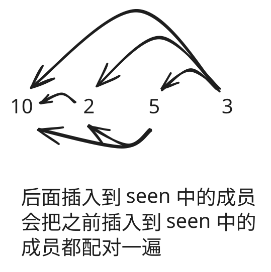

## 1. 📝 题目描述

- [leetcode](https://leetcode.cn/problems/check-if-n-and-its-double-exist/)

给你一个整数数组 `arr`，请你检查是否存在两个整数 `N` 和 `M`，满足 `N` 是 `M` 的两倍（即，`N = 2 * M`）。

更正式地，检查是否存在两个下标 `i` 和 `j` 满足：

- `i != j`
- `0 <= i, j < arr.length`
- `arr[i] == 2 * arr[j]`

---

示例 1：

```txt
输入：arr = [10,2,5,3]
输出：true
```

解释：`N = 10` 是 `M = 5` 的两倍，即 `10 = 2 * 5`。

---

示例 2：

```txt
输入：arr = [7,1,14,11]
输出：true
```

解释：`N = 14` 是 `M = 7` 的两倍，即 `14 = 2 * 7`。

---

示例 3：

```txt
输入：arr = [3,1,7,11]
输出：false
```

解释：在该情况下不存在 N 和 M 满足 `N = 2 * M`。

---

提示：

- `2 <= arr.length <= 500`
- `-10^3 <= arr[i] <= 10^3`

## 2. 🎯 s.1 - 动态哈希表



::: code-group

```js [js]
/**
 * @param {number[]} arr
 * @return {boolean}
 */
var checkIfExist = function (arr) {
  const seen = new Set()

  for (const x of arr) {
    if (seen.has(2 * x) || (x % 2 === 0 && seen.has(x / 2))) return true
    seen.add(x)
  }

  return false
}
```

:::

- 时间复杂度：$O(n)$，单次遍历哈希查找
- 空间复杂度：$O(n)$，哈希表存已见元素

算法思路：

- 维护哈希表 `seen`，记录所有扫描过的成员
- 遍历每个 `x`，若 `2x` 或（`x` 为偶数时）`x/2` 已在 `seen` 中则返回 `true`
- 否则将 `x` 加入 `seen`，遍历完未命中则返回 `false`
