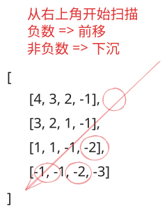

## 1. 📝 题目描述

- [leetcode](https://leetcode.cn/problems/count-negative-numbers-in-a-sorted-matrix/)

给你一个 `m * n` 的矩阵 `grid`，矩阵中的元素无论是按行还是按列，都以非严格递减顺序排列。请你统计并返回 `grid` 中负数的数目。

---

示例 1：

```txt
输入：grid = [
  [4, 3, 2, -1],
  [3, 2, 1, -1],
  [1, 1, -1, -2],
  [-1, -1, -2, -3]
]

输出：8

解释：
矩阵中共有 8 个负数。
```

---

示例 2：

```txt
输入：grid = [[3,2],[1,0]]
输出：0
```

---

提示：

- `m == grid.length`
- `n == grid[i].length`
- `1 <= m, n <= 100`
- `-100 <= grid[i][j] <= 100`

---

进阶：你可以设计一个时间复杂度为 `O(n + m)` 的解决方案吗？

## 2. 🎯 s.1 - 右上角线扫



::: code-group

```js [js]
/**
 * @param {number[][]} grid
 * @return {number}
 */
var countNegatives = function (grid) {
  const m = grid.length
  const n = grid[0].length

  let row = 0
  let col = n - 1
  let count = 0

  while (row < m && col >= 0) {
    if (grid[row][col] < 0) {
      // 当前列从 row 到底部都是负数
      count += m - row
      col--
    } else {
      row++
    }
  }

  return count
}
```

:::

- 时间复杂度：$O(m + n)$，从右上角线性扫描
- 空间复杂度：$O(1)$，只使用了常数级别的额外空间

算法思路：

- 指针置于右上角，若当前位置为负数，则该列当前行及以下均为负，计入并左移一列
- 若为非负则下移一行；直至越界
