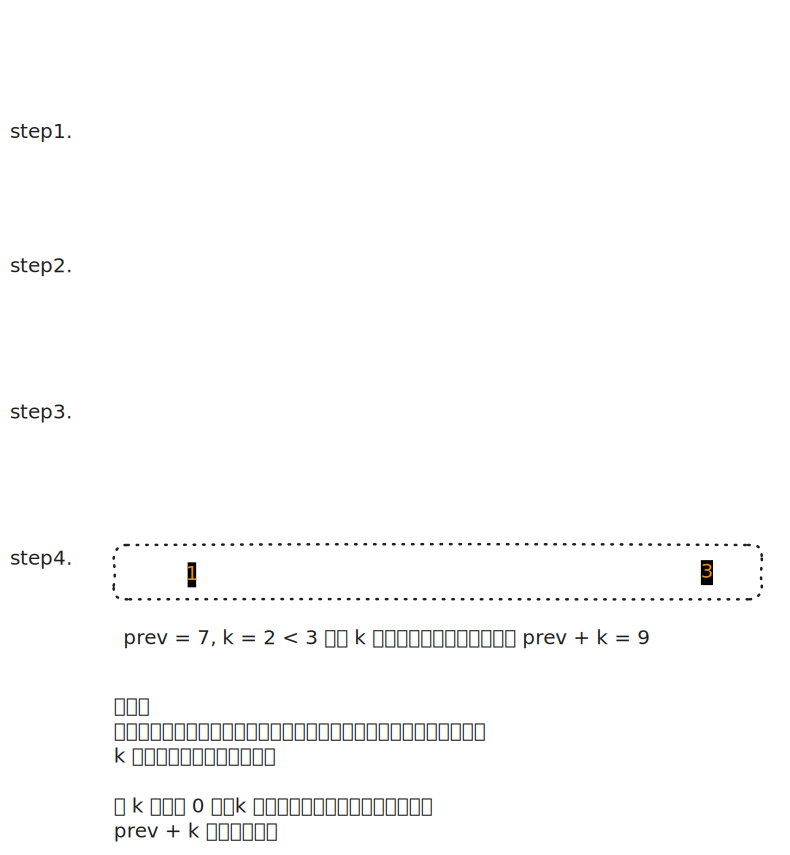

# [1539. 第 k 个缺失的正整数【简单】](https://github.com/tnotesjs/TNotes.leetcode/tree/main/notes/1539.%20%E7%AC%AC%20k%20%E4%B8%AA%E7%BC%BA%E5%A4%B1%E7%9A%84%E6%AD%A3%E6%95%B4%E6%95%B0%E3%80%90%E7%AE%80%E5%8D%95%E3%80%91)

<!-- region:toc -->

- [1. 📝 题目描述](#1--题目描述)
- [2. 🎯 s.1 - 区间扫描](#2--s1---区间扫描)

<!-- endregion:toc -->

## 1. 📝 题目描述

- [leetcode](https://leetcode.cn/problems/kth-missing-positive-number/)

给你一个严格升序排列的正整数数组 `arr` 和一个整数 `k`。

请你找到这个数组里第 `k` 个缺失的正整数。

---

示例 1：

```txt
输入：arr = [2,3,4,7,11], k = 5
输出：9

解释：
缺失的正整数包括 [1,5,6,8,9,10,12,13,...]。
第 5 个缺失的正整数为 9。
```

---

示例 2：

```txt
输入：arr = [1,2,3,4], k = 2
输出：6

解释：
缺失的正整数包括 [5,6,7,...]。
第 2 个缺失的正整数为 6。
```

---

提示：

- `1 <= arr.length <= 1000`
- `1 <= arr[i] <= 1000`
- `1 <= k <= 1000`
- 对于所有 `1 <= i < j <= arr.length` 的 `i` 和 `j` 满足 `arr[i] < arr[j]`

---

进阶：

你可以设计一个时间复杂度小于 `O(n)` 的算法解决此问题吗？

## 2. 🎯 s.1 - 区间扫描



::: code-group

<<< ./solutions/1/1.js [js]

:::

- 时间复杂度：$O(N)$，单次扫描扣减 k
- 空间复杂度：$O(1)$，使用常数级空间

算法思路：

- 依次遍历有序数组，相邻值间缺失量为 `arr[i] - arr[i-1] - 1`
- 当累计缺失覆盖 `k` 时，结果在当前间隙：`arr[i-1] + k`
- 否则扣减 `k` 继续；若数组遍历完仍未覆盖，答案为 `arr[last] + k`
