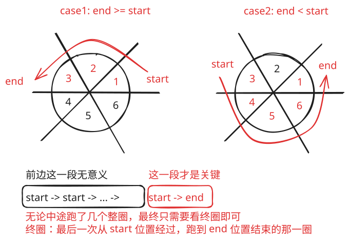

## 1. 📝 题目描述

- [leetcode](https://leetcode.cn/problems/most-visited-sector-in-a-circular-track/)

给你一个整数 `n` 和一个整数数组 `rounds`。有一条圆形赛道由 `n` 个扇区组成，扇区编号从 `1` 到 `n`。现将在这条赛道上举办一场马拉松比赛，该马拉松全程由 `m` 个阶段组成。其中，第 `i` 个阶段将会从扇区 `rounds[i - 1]` 开始，到扇区 `rounds[i]` 结束。举例来说，第 `1` 阶段从 `rounds[0]` 开始，到 `rounds[1]` 结束。

请你以数组形式返回经过次数最多的那几个扇区，按扇区编号升序排列。

注意，赛道按扇区编号升序逆时针形成一个圆（请参见第一个示例）。

---

示例 1：


```txt
输入：n = 4, rounds = [1,3,1,2]
输出：[1,2]
```

解释：

本场马拉松比赛从扇区 1 开始。经过各个扇区的次序如下所示：

1 --> 2 --> 3（阶段 1 结束）--> 4 --> 1（阶段 2 结束）--> 2（阶段 3 结束，即本场马拉松结束）

其中，扇区 1 和 2 都经过了两次，它们是经过次数最多的两个扇区。扇区 3 和 4 都只经过了一次。

---

示例 2：

```txt
输入：n = 2, rounds = [2,1,2,1,2,1,2,1,2]
输出：[2]
```

---

示例 3：

```txt
输入：n = 7, rounds = [1,3,5,7]
输出：[1,2,3,4,5,6,7]
```

---

提示：

- `2 <= n <= 100`
- `1 <= m <= 100`
- `rounds.length == m + 1`
- `1 <= rounds[i] <= n`
- `rounds[i] != rounds[i + 1]`，其中 `0 <= i < m`

## 2. 🎯 s.1 - 终圈区间输出



::: code-group

```js [js]
/**
 * @param {number} n
 * @param {number[]} rounds
 * @return {number[]}
 */
var mostVisited = function (n, rounds) {
  const start = rounds[0]
  const end = rounds[rounds.length - 1]
  const res = []

  if (start <= end) {
    for (let i = start; i <= end; i++) res.push(i)
  } else {
    for (let i = 1; i <= end; i++) res.push(i)
    for (let i = start; i <= n; i++) res.push(i)
  }

  return res
}
// Accepted - 2026.01.16
// 204/204 cases passed (0 ms)
// Your runtime beats 100 % of javascript submissions
// Your memory usage beats 100 % of javascript submissions (54.9 MB)
```

:::

- 时间复杂度：$O(N)$，按需要输出扇区
- 空间复杂度：$O(N)$，结果数组占用

算法思路：

- 前面跑的整圈对最终的结果无影响，所有扇区都会被经过一次，彼此之间互相抵消
- 终圈经过的扇区就是赛道上经过次数最多的扇区
- 终圈经过的扇区可以通过起点 `rounds[0]` 和终点 `rounds[last]` 确定
  - 跑圈时，从起点 `rounds[0]` 走到终点 `rounds[last]` 的区间（逆时针递增）
  - 若起点不超过终点 `start <= end` => 区间为 `[start, end]`
  - 否则拆成两部分 `[1, end] + [start, n]`
- 注意最终结果要按升序返回
