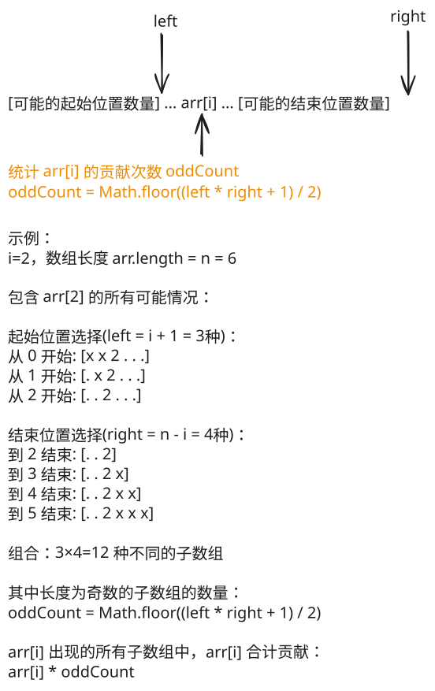

## 1. 📝 题目描述

- [leetcode](https://leetcode.cn/problems/sum-of-all-odd-length-subarrays/)

给你一个正整数数组 `arr`，请你计算所有可能的奇数长度子数组的和。

子数组定义为原数组中的一个连续子序列。

请你返回 `arr` 中所有奇数长度子数组的和。

---

示例 1：

```txt
输入：arr = [1,4,2,5,3]
输出：58
解释：所有奇数长度子数组和它们的和为：
[1] = 1
[4] = 4
[2] = 2
[5] = 5
[3] = 3
[1,4,2] = 7
[4,2,5] = 11
[2,5,3] = 10
[1,4,2,5,3] = 15
我们将所有值求和得到 1 + 4 + 2 + 5 + 3 + 7 + 11 + 10 + 15 = 58
```

示例 2：

```txt
输入：arr = [1,2]
输出：3
解释：总共只有 2 个长度为奇数的子数组，[1] 和 [2]。它们的和为 3。
```

示例 3：

```txt
输入：arr = [10,11,12]
输出：66
```

---

提示：

- `1 <= arr.length <= 100`
- `1 <= arr[i] <= 1000`

---

进阶：

你可以设计一个 $O(n)$ 时间复杂度的算法解决此问题吗？

## 2. 🎯 s.1 - 贡献计数



::: code-group

```js [js]
/**
 * @param {number[]} arr
 * @return {number}
 */
var sumOddLengthSubarrays = function (arr) {
  const n = arr.length
  let ans = 0

  for (let i = 0; i < n; i++) {
    // 包含 arr[i] 的子数组，有多少种可能的起始位置
    const left = i + 1

    // 包含 arr[i] 的子数组，有多少种可能的结束位置
    const right = n - i

    // 每种起始位置可以和任意一种结束位置组合
    const total = left * right

    const oddCount = Math.floor((total + 1) / 2)
    ans += arr[i] * oddCount
  }

  return ans
}
```

:::

- 时间复杂度：$O(N)$，单次遍历计算贡献
- 空间复杂度：$O(1)$，常数变量

算法思路：

- 计算每个元素在所有奇数长度子数组中的出现次数
- 索引 i 的元素可以与左侧 `(i + 1)` 个位置和右侧 `(n - i)` 个位置组合
- 奇数长度子数组中的出现次数为 `((i+1) * (n-i) + 1) / 2`
- 累加每个元素值乘以其出现次数
