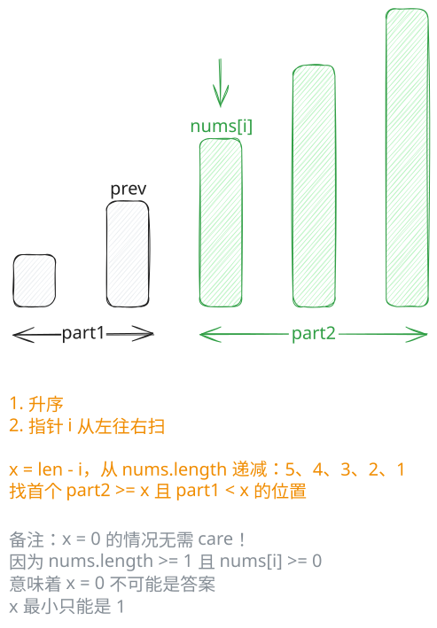

## 1. 📝 题目描述

- [leetcode](https://leetcode.cn/problems/special-array-with-x-elements-greater-than-or-equal-x/)

给你一个非负整数数组 `nums`。如果存在一个数 `x`，使得 `nums` 中恰好有 `x` 个元素大于或者等于 `x`，那么就称 `nums` 是一个特殊数组，而 `x` 是该数组的特征值。

注意：`x` 不必是 `nums` 的中的元素。

如果数组 `nums` 是一个特殊数组，请返回它的特征值 `x`。否则，返回 `-1`。可以证明的是，如果 `nums` 是特殊数组，那么其特征值 `x` 是唯一的。

---

示例 1：

```txt
输入：nums = [3,5]
输出：2
```

解释：有 `2` 个元素（`3` 和 `5`）大于或等于 `2`。

---

示例 2：

```txt
输入：nums = [0,0]
输出：-1
```

解释：

- 没有满足题目要求的特殊数组，故而也不存在特征值 `x`。
- 如果 `x = 0`，应该有 `0` 个元素 `>= x`，但实际有 `2` 个。
- 如果 `x = 1`，应该有 `1` 个元素 `>= x`，但实际有 `0` 个。
- 如果 `x = 2`，应该有 `2` 个元素 `>= x`，但实际有 `0` 个。
- `x` 不能取更大的值，因为 `nums` 中只有两个元素。

---

示例 3：

```txt
输入：nums = [0,4,3,0,4]
输出：3
```

解释：有 3 个元素大于或等于 3。

---

示例 4：

```txt
输入：nums = [3,6,7,7,0]
输出：-1
```

---

提示：

- `1 <= nums.length <= 100`
- `0 <= nums[i] <= 1000`

## 2. 🎯 s.1 - 排序枚举



::: code-group

```c [c]
int cmp(const void* a, const void* b) {
    return *(int*)a - *(int*)b;
}

int specialArray(int* nums, int numsSize) {
    // 升序排序
    qsort(nums, numsSize, sizeof(int), cmp);
    
    for (int i = 0; i < numsSize; i++) {
        int x = numsSize - i;
        int prev = (i == 0) ? -1 : nums[i - 1];
        if (nums[i] >= x && prev < x) {
            return x;
        }
    }
    
    return -1;
}
```

```js [js]
/**
 * @param {number[]} nums
 * @return {number}
 */
var specialArray = function (nums) {
  // 升序排序
  nums.sort((a, b) => a - b)
  const n = nums.length

  for (let i = 0; i < n; i++) {
    const x = n - i
    const prev = i === 0 ? -Infinity : nums[i - 1]
    if (nums[i] >= x && prev < x) return x
  }

  return -1
}
```

```py [py]
class Solution:
    def specialArray(self, nums: List[int]) -> int:
        # 升序排序
        nums.sort()
        n = len(nums)

        for i in range(n):
            x = n - i
            prev = float("-inf") if i == 0 else nums[i - 1]
            if nums[i] >= x and prev < x:
                return x

        return -1
```

:::

- 时间复杂度：$O(N \log N)$，其中 N 是数组 nums 的长度，排序需要 $O(N \log N)$，遍历需要 O(N)
- 空间复杂度：$O(\log N)$，排序所需的栈空间

算法思路：

- 对数组 `nums` 进行升序排序
- 遍历排序后的数组，对于每个位置 `i`：
  - 计算候选特征值 `x = n - i`（从位置 `i` 到末尾的元素个数）
  - 获取前一个元素的值 `prev`（如果 `i = 0`，设为负无穷）
  - 检查是否满足特征值条件：
    - `nums[i] >= x`：当前及后续元素都 >= x
    - `prev < x`：前面的元素都 < x，确保恰好有 x 个元素 >= x
  - 如果满足条件，返回 `x`
- 如果遍历结束未找到，返回 -1
