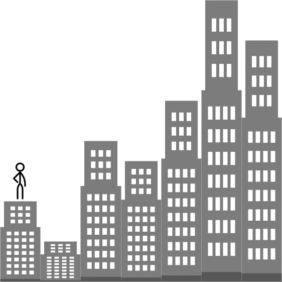

## 1. 📝 题目描述

- [leetcode](https://leetcode.cn/problems/furthest-building-you-can-reach/)

给你一个整数数组 `heights`，表示建筑物的高度。另有一些砖块 `bricks` 和梯子 `ladders`。

你从建筑物 `0` 开始旅程，不断向后面的建筑物移动，期间可能会用到砖块或梯子。

当从建筑物 `i` 移动到建筑物 `i+1`（下标 从 0 开始 ）时：

- 如果当前建筑物的高度 大于或等于 下一建筑物的高度，则不需要梯子或砖块
- 如果当前建筑的高度 小于 下一个建筑的高度，您可以使用 一架梯子 或 `(h[i+1] - h[i])` 个砖块

如果以最佳方式使用给定的梯子和砖块，返回你可以到达的最远建筑物的下标（下标 从 0 开始 ）。

---

示例 1：



```txt
输入：heights = [4,2,7,6,9,14,12], bricks = 5, ladders = 1
输出：4
解释：从建筑物 0 出发，你可以按此方案完成旅程：
- 不使用砖块或梯子到达建筑物 1，因为 4 >= 2
- 使用 5 个砖块到达建筑物 2。你必须使用砖块或梯子，因为 2 < 7
- 不使用砖块或梯子到达建筑物 3，因为 7 >= 6
- 使用唯一的梯子到达建筑物 4。你必须使用砖块或梯子，因为 6 < 9
无法越过建筑物 4，因为没有更多砖块或梯子。
```

示例 2：

```txt
输入：heights = [4,12,2,7,3,18,20,3,19], bricks = 10, ladders = 2
输出：7
```

示例 3：

```txt
输入：heights = [14,3,19,3], bricks = 17, ladders = 0
输出：3
```

---

提示：

- `1 <= heights.length <= 10^5`
- `1 <= heights[i] <= 10^6`
- `0 <= bricks <= 10^9`
- `0 <= ladders <= heights.length`

## 2. 🎯 s.1 - 贪心 + 最小堆

::: code-group

```js [js]
/**
 * @param {number[]} heights
 * @param {number} bricks
 * @param {number} ladders
 * @return {number}
 */
var furthestBuilding = function (heights, bricks, ladders) {
  // 最小堆：将樯子用在最大的几次跳跃上
  const minHeap = []
  const push = (v) => {
    minHeap.push(v)
    let i = minHeap.length - 1
    while (i > 0) {
      const p = (i - 1) >> 1
      if (minHeap[p] <= minHeap[i]) break
      ;[minHeap[p], minHeap[i]] = [minHeap[i], minHeap[p]]
      i = p
    }
  }
  const pop = () => {
    const top = minHeap[0]
    const last = minHeap.pop()
    if (minHeap.length) {
      minHeap[0] = last
      let i = 0
      while (true) {
        let s = i,
          l = 2 * i + 1,
          r = 2 * i + 2
        if (l < minHeap.length && minHeap[l] < minHeap[s]) s = l
        if (r < minHeap.length && minHeap[r] < minHeap[s]) s = r
        if (s === i) break
        ;[minHeap[s], minHeap[i]] = [minHeap[i], minHeap[s]]
        i = s
      }
    }
    return top
  }
  for (let i = 0; i < heights.length - 1; i++) {
    const diff = heights[i + 1] - heights[i]
    if (diff <= 0) continue
    push(diff)
    if (minHeap.length > ladders) bricks -= pop()
    if (bricks < 0) return i
  }
  return heights.length - 1
}
```

```c [c]
#include <stdlib.h>

static void heapPush(int* h, int* sz, int v) {
    h[(*sz)++] = v;
    int i = *sz - 1;
    while (i > 0) {
        int p = (i-1)/2;
        if (h[p] <= h[i]) break;
        int t = h[p]; h[p] = h[i]; h[i] = t;
        i = p;
    }
}

static int heapPop(int* h, int* sz) {
    int top = h[0];
    h[0] = h[--(*sz)];
    int i = 0;
    while (1) {
        int s = i, l = 2*i+1, r = 2*i+2;
        if (l < *sz && h[l] < h[s]) s = l;
        if (r < *sz && h[r] < h[s]) s = r;
        if (s == i) break;
        int t = h[s]; h[s] = h[i]; h[i] = t;
        i = s;
    }
    return top;
}

int furthestBuilding(int* heights, int heightsSize, int bricks, int ladders) {
    int* heap = (int*)malloc(heightsSize * sizeof(int));
    int sz = 0;
    for (int i = 0; i < heightsSize - 1; i++) {
        int diff = heights[i+1] - heights[i];
        if (diff <= 0) continue;
        heapPush(heap, &sz, diff);
        if (sz > ladders) bricks -= heapPop(heap, &sz);
        if (bricks < 0) { free(heap); return i; }
    }
    free(heap);
    return heightsSize - 1;
}
```

```py [py]
class Solution:
    def furthestBuilding(self, heights: list[int], bricks: int, ladders: int) -> int:
        import heapq
        heap = []
        for i in range(len(heights) - 1):
            diff = heights[i + 1] - heights[i]
            if diff <= 0:
                continue
            heapq.heappush(heap, diff)
            if len(heap) > ladders:
                bricks -= heapq.heappop(heap)
            if bricks < 0:
                return i
        return len(heights) - 1
```

:::

- 时间复杂度：$O(n\log n)$，其中 $n$ 是建筑数量
- 空间复杂度：$O(n)$，堆的大小

算法思路：

- 遍历建筑，遇到需要爬升的高度差 diff 时，优先使用梯子（将 diff 入堆）
- 当梯子用完时（堆大小超过 ladders），将堆中最小的 diff 弹出，改用砖块
- 砖块不够用时返回当前位置
