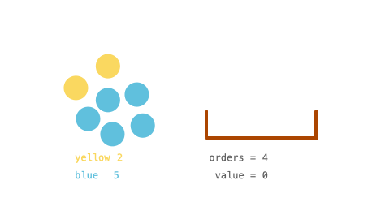

## 1. 📝 题目描述

- [leetcode](https://leetcode.cn/problems/sell-diminishing-valued-colored-balls/)

你有一些球的库存 `inventory`，里面包含着不同颜色的球。一个顾客想要 任意颜色 总数为 `orders` 的球。

这位顾客有一种特殊的方式衡量球的价值：每个球的价值是目前剩下的 同色球 的数目。比方说还剩下 `6` 个黄球，那么顾客买第一个黄球的时候该黄球的价值为 `6`。这笔交易以后，只剩下 `5` 个黄球了，所以下一个黄球的价值为 `5` （也就是球的价值随着顾客购买同色球是递减的）

给你整数数组 `inventory`，其中 `inventory[i]` 表示第 `i` 种颜色球一开始的数目。同时给你整数 `orders`，表示顾客总共想买的球数目。你可以按照 任意顺序 卖球。

请你返回卖了 `orders` 个球以后 最大 总价值之和。由于答案可能会很大，请你返回答案对 `10^9 + 7` 取余数 的结果。

---

示例 1：



```txt
输入：inventory = [2,5], orders = 4
输出：14

解释：
卖 1 个第一种颜色的球（价值为 2 )，卖 3 个第二种颜色的球（价值为 5 + 4 + 3）。
最大总和为 2 + 5 + 4 + 3 = 14。
```

示例 2：

```txt
输入：inventory = [3,5], orders = 6
输出：19

解释：
卖 2 个第一种颜色的球（价值为 3 + 2），卖 4 个第二种颜色的球（价值为 5 + 4 + 3 + 2）。
最大总和为 3 + 2 + 5 + 4 + 3 + 2 = 19。
```

示例 3：

```txt
输入：inventory = [2,8,4,10,6], orders = 20
输出：110
```

示例 4：

```txt
输入：inventory = [1000000000], orders = 1000000000
输出：21

解释：
卖 1000000000 次第一种颜色的球，总价值为 500000000500000000。
500000000500000000 对 109 + 7 取余为 21。
```

---

提示：

- `1 <= inventory.length <= 10^5`
- `1 <= inventory[i] <= 10^9`
- `1 <= orders <= min(sum(inventory[i]), 10^9)`

## 2. 🎯 s.1 - 排序 + 贪心

::: code-group

```js [js]
/**
 * @param {number[]} inventory
 * @param {number} orders
 * @return {number}
 */
var maxProfit = function (inventory, orders) {
  const MOD = 1e9 + 7
  inventory.sort((a, b) => b - a)
  inventory.push(0)
  let res = 0n,
    n = inventory.length
  const mod = BigInt(MOD)
  for (let i = 0; i < n - 1; i++) {
    const width = BigInt(i + 1)
    const diff = BigInt(inventory[i] - inventory[i + 1])
    const total = width * diff
    if (BigInt(orders) <= total) {
      const q = BigInt(Math.floor(orders / Number(width)))
      const r = BigInt(orders % Number(width))
      const high = BigInt(inventory[i])
      const low = high - q + 1n
      res =
        (res +
          ((((((((high + low) % mod) * q) % mod) * width) % mod) * 500000004n) %
            mod)) %
        mod
      res = (res + ((high - q) % mod) * r) % mod
      return Number(((res % mod) + mod) % mod)
    }
    orders -= Number(total)
    const high = BigInt(inventory[i])
    const low = BigInt(inventory[i + 1] + 1)
    res =
      (res +
        ((((((((high + low) % mod) * diff) % mod) * width) % mod) *
          500000004n) %
          mod)) %
      mod
  }
  return Number(((res % mod) + mod) % mod)
}
```

```c [c]
int cmp1648(const void* a, const void* b) { return *(int*)b - *(int*)a; }

int maxProfit(int* inventory, int inventorySize, int orders) {
    long long MOD = 1000000007;
    qsort(inventory, inventorySize, sizeof(int), cmp1648);
    long long res = 0;
    int i = 0;
    while (orders > 0) {
        int cur = inventory[i];
        int next = (i + 1 < inventorySize) ? inventory[i + 1] : 0;
        long long width = i + 1;
        long long diff = cur - next;
        long long total = width * diff;
        if (orders <= total) {
            long long q = orders / width;
            long long r = orders % width;
            res = (res + (2LL * cur - q + 1) % MOD * q % MOD * 500000004 % MOD * width) % MOD;
            res = (res + (long long)(cur - q) % MOD * r) % MOD;
            orders = 0;
        } else {
            res = (res + (long long)(cur + next + 1) % MOD * diff % MOD * 500000004 % MOD * width) % MOD;
            orders -= (int)total;
            i++;
        }
    }
    return (int)((res % MOD + MOD) % MOD);
}
```

```py [py]
class Solution:
    def maxProfit(self, inventory: list[int], orders: int) -> int:
        MOD = 10 ** 9 + 7
        inventory.sort(reverse=True)
        inventory.append(0)
        res = 0
        for i in range(len(inventory) - 1):
            width = i + 1
            diff = inventory[i] - inventory[i + 1]
            total = width * diff
            if orders <= total:
                q, r = divmod(orders, width)
                res += (inventory[i] + inventory[i] - q + 1) * q // 2 * width
                res += (inventory[i] - q) * r
                return res % MOD
            orders -= total
            res += (inventory[i] + inventory[i + 1] + 1) * diff // 2 * width
        return res % MOD
```

:::

- 时间复杂度：$O(n\log n)$，其中 $n$ 是颜色种类数
- 空间复杂度：$O(\log n)$，排序栈空间

算法思路：

- 将库存降序排列，从库存最多的颜色开始卖
- 每轮将当前最高库存降到下一个库存水平，使用等差数列公式批量计算收益
- 若 orders 不够批量售完，则均匀分配剩余 orders
