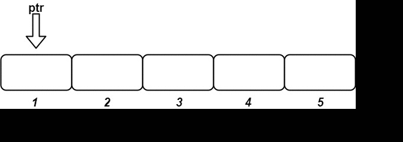

## 1. 📝 题目描述

- [leetcode](https://leetcode.cn/problems/design-an-ordered-stream/)

有 `n` 个 `(id, value)` 对，其中 `id` 是 `1` 到 `n` 之间的一个整数，`value` 是一个字符串。不存在 `id` 相同的两个 `(id, value)` 对。

设计一个流，以任意顺序获取 `n` 个 `(id, value)` 对，并在多次调用时 按 `id` 递增的顺序返回一些值。

实现 `OrderedStream` 类：

- `OrderedStream(int n)` 构造一个能接收 `n` 个值的流，并将当前指针 `ptr` 设为 `1`。
- `String[] insert(int id, String value)` 向流中存储新的 `(id, value)` 对。存储后：
  - 如果流存储有 `id = ptr` 的 `(id, value)` 对，则找出从 `id = ptr` 开始的最长 id 连续递增序列，并按顺序返回与这些 id 关联的值的列表。然后，将 `ptr` 更新为最后那个 `id + 1`。
  - 否则，返回一个空列表。

---

示例：



```txt
输入：
["OrderedStream", "insert", "insert", "insert", "insert", "insert"]
[[5], [3, "ccccc"], [1, "aaaaa"], [2, "bbbbb"], [5, "eeeee"], [4, "ddddd"]]

输出：
[null, [], ["aaaaa"], ["bbbbb", "ccccc"], [], ["ddddd", "eeeee"]]
```

解释：

- `OrderedStream os= new OrderedStream(5);`
- `os.insert(3, "ccccc"); // 插入 (3, "ccccc")，返回 []`
- `os.insert(1, "aaaaa"); // 插入 (1, "aaaaa")，返回 ["aaaaa"]`
- `os.insert(2, "bbbbb"); // 插入 (2, "bbbbb")，返回 ["bbbbb", "ccccc"]`
- `os.insert(5, "eeeee"); // 插入 (5, "eeeee")，返回 []`
- `os.insert(4, "ddddd"); // 插入 (4, "ddddd")，返回 ["ddddd", "eeeee"]`

---

提示：

- `1 <= n <= 1000`
- `1 <= id <= n`
- `value.length == 5`
- `value` 仅由小写字母组成
- 每次调用 `insert` 都会使用一个唯一的 `id`
- 恰好调用 `n` 次 `insert`

## 2. 🎯 s.1 - 暴力解法

::: code-group

```c [c]
typedef struct {
    char** arr;
    int size;
    int ptr;
} OrderedStream;

OrderedStream* orderedStreamCreate(int n) {
    OrderedStream* obj = (OrderedStream*)malloc(sizeof(OrderedStream));
    obj->arr = (char**)calloc(n, sizeof(char*));
    obj->size = n;
    obj->ptr = 1;
    return obj;
}

char** orderedStreamInsert(OrderedStream* obj, int idKey, char* value, int* retSize) {
    obj->arr[idKey - 1] = value;

    if (idKey != obj->ptr) {
        *retSize = 0;
        return NULL;
    }

    char** res = (char**)malloc(obj->size * sizeof(char*));
    int count = 0;
    while (obj->ptr <= obj->size && obj->arr[obj->ptr - 1] != NULL) {
        res[count++] = obj->arr[obj->ptr - 1];
        obj->ptr++;
    }

    *retSize = count;
    return res;
}

void orderedStreamFree(OrderedStream* obj) {
    free(obj->arr);
    free(obj);
}
```

```js [js]
/**
 * @param {number} n
 */
var OrderedStream = function (n) {
  this.arr = new Array(n)
  this.ptr = 1
}

/**
 * @param {number} idKey
 * @param {string} value
 * @return {string[]}
 */
OrderedStream.prototype.insert = function (idKey, value) {
  this.arr[idKey - 1] = value

  if (idKey !== this.ptr) return []

  const res = []
  while (this.ptr <= this.arr.length && this.arr[this.ptr - 1] !== undefined) {
    res.push(this.arr[this.ptr - 1])
    this.ptr++
  }

  return res
}

/**
 * Your OrderedStream object will be instantiated and called as such:
 * var obj = new OrderedStream(n)
 * var param_1 = obj.insert(idKey,value)
 */
```

```py [py]
class OrderedStream:

    def __init__(self, n: int):
        self.arr = [None] * n
        self.ptr = 1

    def insert(self, idKey: int, value: str) -> List[str]:
        self.arr[idKey - 1] = value

        if idKey != self.ptr:
            return []

        res = []
        while self.ptr <= len(self.arr) and self.arr[self.ptr - 1] is not None:
            res.append(self.arr[self.ptr - 1])
            self.ptr += 1

        return res

# Your OrderedStream object will be instantiated and called as such:
# obj = OrderedStream(n)
# param_1 = obj.insert(idKey,value)
```

:::

- 时间复杂度：insert 操作最坏 $O(N)$，当插入触发连续段返回时，需要遍历所有连续已填充的位置
- 空间复杂度：$O(N)$，数组需要存储 N 个值

算法思路：

- 初始化：创建长度为 n 的数组 `arr`，指针 `ptr` 初始化为 1
- 插入时将 `value` 存储到 `arr[idKey - 1]` 位置（id 从 1 开始，数组从 0 开始）
- 检查插入的 `idKey` 是否等于当前指针 `ptr`：
  - 如果不等于，说明插入的位置在指针之后，返回空数组
  - 如果等于，说明可以从当前指针位置开始收集连续的值
- 从 `ptr` 开始向后遍历，收集所有连续已填充的值到结果数组：
  - 每收集一个值，指针 `ptr` 加 1
  - 直到遇到未填充的位置或数组末尾
- 返回收集到的结果数组
