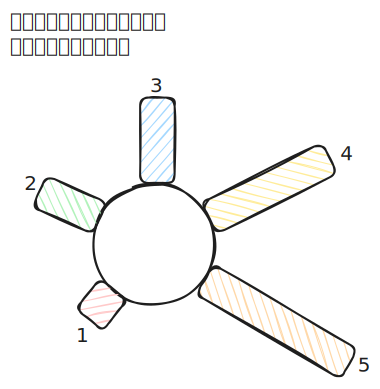

# [1752. 检查数组是否经排序和轮转得到【简单】](https://github.com/tnotesjs/TNotes.leetcode/tree/main/notes/1752.%20%E6%A3%80%E6%9F%A5%E6%95%B0%E7%BB%84%E6%98%AF%E5%90%A6%E7%BB%8F%E6%8E%92%E5%BA%8F%E5%92%8C%E8%BD%AE%E8%BD%AC%E5%BE%97%E5%88%B0%E3%80%90%E7%AE%80%E5%8D%95%E3%80%91)

<!-- region:toc -->

- [1. 📝 题目描述](#1--题目描述)
- [2. 🎯 s.1 - 断点计数](#2--s1---断点计数)

<!-- endregion:toc -->

## 1. 📝 题目描述

- [leetcode](https://leetcode.cn/problems/check-if-array-is-sorted-and-rotated/)

给你一个数组 `nums`。`nums` 的源数组中，所有元素与 `nums` 相同，但按非递减顺序排列。

如果 `nums` 能够由源数组轮转若干位置（包括 0 个位置）得到，则返回 `true`；否则，返回 `false`。

源数组中可能存在重复项。

---

注意：数组 `A` 在轮转 `x` 个位置后得到长度相同的数组 `B`，使得对于每一个有效的下标 `i`，满足 `B[i] == A[(i+x) % A.length]`。

---

示例 1：

```txt
输入：nums = [3,4,5,1,2]
输出：true

解释：
[1,2,3,4,5] 为有序的源数组。
可以轮转 x = 2 个位置，使新数组从值为 3 的元素开始：[3,4,5,1,2]。
```

---

示例 2：

```txt
输入：nums = [2,1,3,4]
输出：false

解释：
源数组无法经轮转得到 nums。
```

---

示例 3：

```txt
输入：nums = [1,2,3]
输出：true

解释：
[1,2,3] 为有序的源数组。
可以轮转 x = 0 个位置（即不轮转）得到 nums。
```

---

提示：

- `1 <= nums.length <= 100`
- `1 <= nums[i] <= 100`

## 2. 🎯 s.1 - 断点计数



::: code-group

<<< ./solutions/1/1.js [js]

:::

- 时间复杂度：$O(N)$，其中 N 是数组 nums 的长度
- 空间复杂度：$O(1)$，只使用常数额外空间

算法思路：

- 非递减数组经过轮转后，最多只会在某处出现一次降序"断点"（即 `nums[i] > nums[i+1]`）
- 初始化断点计数器 `breaks` 为 0
- 遍历数组，检查每个位置 `i` 和下一个位置 `(i+1) % n`（使用取模处理循环）：
  - 如果 `nums[i] > nums[(i+1) % n]`，说明出现降序断点，`breaks` 加 1
  - 如果 `breaks` 超过 1，提前返回 `false`
- 遍历结束后返回 `true`（断点不超过 1 次）
