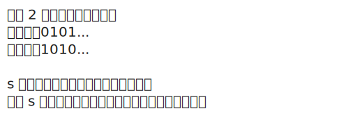

# [1758. 生成交替二进制字符串的最少操作数【简单】](https://github.com/tnotesjs/TNotes.leetcode/tree/main/notes/1758.%20%E7%94%9F%E6%88%90%E4%BA%A4%E6%9B%BF%E4%BA%8C%E8%BF%9B%E5%88%B6%E5%AD%97%E7%AC%A6%E4%B8%B2%E7%9A%84%E6%9C%80%E5%B0%91%E6%93%8D%E4%BD%9C%E6%95%B0%E3%80%90%E7%AE%80%E5%8D%95%E3%80%91)

<!-- region:toc -->

- [1. 📝 题目描述](#1--题目描述)
- [2. 🎯 s.1 - 暴力解法](#2--s1---暴力解法)

<!-- endregion:toc -->

## 1. 📝 题目描述

- [leetcode](https://leetcode.cn/problems/minimum-changes-to-make-alternating-binary-string/)

给你一个仅由字符 `'0'` 和 `'1'` 组成的字符串 `s`。一步操作中，你可以将任一 `'0'` 变成 `'1'`，或者将 `'1'` 变成 `'0'`。

交替字符串定义为：如果字符串中不存在相邻两个字符相等的情况，那么该字符串就是交替字符串。例如，字符串 `"010"` 是交替字符串，而字符串 `"0100"` 不是。

返回使 `s` 变成交替字符串所需的最少操作数。

---

示例 1：

```txt
输入：s = "0100"
输出：1

解释：
如果将最后一个字符变为 '1'，s 就变成 "0101"，即符合交替字符串定义。
```

---

示例 2：

```txt
输入：s = "10"
输出：0

解释：
s 已经是交替字符串。
```

---

示例 3：

```txt
输入：s = "1111"
输出：2

解释：
需要 2 步操作得到 "0101" 或 "1010"。
```

---

提示：

- `1 <= s.length <= 10^4`
- `s[i]` 是 `'0'` 或 `'1'`

## 2. 🎯 s.1 - 暴力解法



::: code-group

<<< ./solutions/1/1.js [js]

:::

- 时间复杂度：$O(N)$，其中 N 是字符串 s 的长度
- 空间复杂度：$O(1)$，只使用常数额外空间

算法思路：

- 交替二进制字符串只有两种模式：以 `'0'` 开头（"0101..."）或以 `'1'` 开头（"1010..."）
- 初始化两个计数器 `diffStart0` 和 `diffStart1`，分别统计转为这两种模式时需要修改的字符数
- 遍历字符串的每个位置 `i`：
  - 计算在"0101..."模式下位置 `i` 应该是什么字符（偶数位为 `'0'`，奇数位为 `'1'`）
  - 计算在"1010..."模式下位置 `i` 应该是什么字符（偶数位为 `'1'`，奇数位为 `'0'`）
  - 如果当前字符与期望字符不匹配，对应计数器加 1
- 返回两个计数器中的较小值，即为最少操作数
