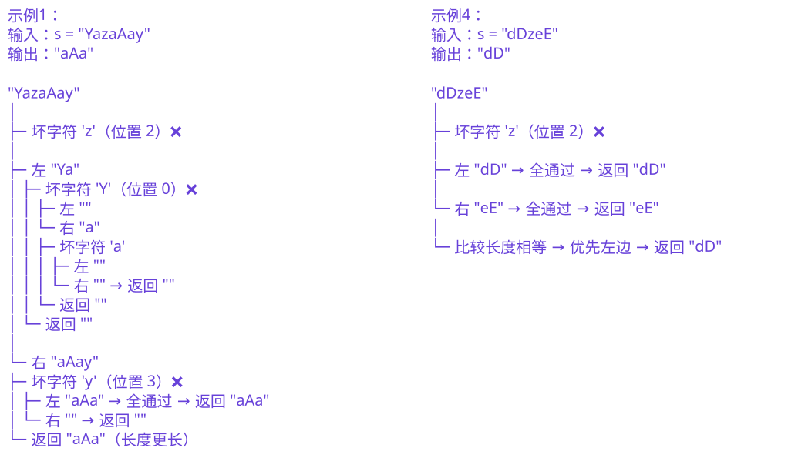

## 1. 📝 题目描述

- [leetcode](https://leetcode.cn/problems/longest-nice-substring/)

当一个字符串 `s` 包含的每一种字母的大写和小写形式同时出现在 `s` 中，就称这个字符串 `s` 是美好字符串。比方说，`"abABB"` 是美好字符串，因为 `'A'` 和 `'a'` 同时出现了，且 `'B'` 和 `'b'` 也同时出现了。然而，`"abA"` 不是美好字符串因为 `'b'` 出现了，而 `'B'` 没有出现。

给你一个字符串 `s`，请你返回 `s` 最长的美好子字符串。如果有多个答案，请你返回最早出现的一个。如果不存在美好子字符串，请你返回一个空字符串。

---

示例 1：

```txt
输入：s = "YazaAay"
输出："aAa"

解释：
"aAa" 是一个美好字符串
  因为这个子串中仅含一种字母，其小写形式 'a' 和大写形式 'A' 也同时出现了。
"aAa" 是最长的美好子字符串。
```

---

示例 2：

```txt
输入：s = "Bb"
输出："Bb"

解释：
"Bb" 是美好字符串，因为 'B' 和 'b' 都出现了。整个字符串也是原字符串的子字符串。
```

---

示例 3：

```txt
输入：s = "c"
输出：""

解释：
没有美好子字符串。
```

---

示例 4：

```txt
输入：s = "dDzeE"
输出："dD"

解释：
"dD" 和 "eE" 都是最长美好子字符串。
由于有多个美好子字符串，返回 "dD"，因为它出现得最早。
```

---

提示：

- `1 <= s.length <= 100`
- `s` 只包含大写和小写英文字母。

## 2. 🎯 s.1 - 分治按断点拆分



::: code-group

```js [js]
/**
 * @param {string} s
 * @return {string}
 */
var longestNiceSubstring = function (s) {
  // 分治
  const dfs = (str) => {
    if (str.length < 2) return ''
    const set = new Set(str)
    for (let i = 0; i < str.length; i += 1) {
      const ch = str[i]
      const counterpart =
        ch === ch.toLowerCase() ? ch.toUpperCase() : ch.toLowerCase()

      // 坏字符作为切割点
      if (!set.has(counterpart)) {
        // 递归左右
        const left = dfs(str.slice(0, i))
        const right = dfs(str.slice(i + 1))

        // 先比长度，长度相同取左，保证最早出现优先
        return right.length > left.length ? right : left
      }
    }
    return str
  }

  return dfs(s)
}
```

:::

- 时间复杂度：$O(N^2)$，其中 N 是字符串 s 的长度，最坏情况下每层递归构建集合需 $O(N)$，递归深度最多 $O(N)$
- 空间复杂度：$O(N)$，递归调用栈和字符集合所需空间

算法思路：

- 使用分治法递归处理字符串，如果字符串长度小于 2，直接返回空字符串
- 构建当前字符串的字符集合 `set`
- 遍历字符串，检查每个字符的对应形式（大写对应小写，小写对应大写）是否存在：
  - 如果找到"坏字符"（对应形式不存在），以该位置为断点，递归处理左右两个子串
  - 比较左右子串的长度，返回更长的（长度相同时返回左侧，保证最早出现）
- 如果所有字符都有对应形式，说明当前字符串是美好字符串，直接返回
