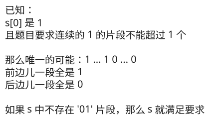

## 1. 📝 题目描述

- [leetcode](https://leetcode.cn/problems/check-if-binary-string-has-at-most-one-segment-of-ones/)

给你一个二进制字符串 `s`，该字符串不含前导零。

如果 `s` 包含零个或一个由连续的 `'1'` 组成的字段，返回 `true`​​​。否则，返回 `false`。

---

示例 1：

```txt
输入：s = "1001"
输出：false

解释：
由连续若干个 '1' 组成的字段数量为 2，返回 false
```

---

示例 2：

```txt
输入：s = "110"
输出：true
```

---

提示：

- `1 <= s.length <= 100`
- `s[i]`​​​​ 为 `'0'` 或 `'1'`
- `s[0]` 为 `'1'`

## 2. 🎯 s.1 - 暴力解法



::: code-group

```js [js]
/**
 * @param {string} s
 * @return {boolean}
 */
var checkOnesSegment = function (s) {
  // 如果包含 '01' 子串，说明 '0' 后面还有 '1'，即存在多个 '1' 字段
  return !s.includes('01')
}
```

:::

- 时间复杂度：$O(N)$，其中 N 是字符串长度，includes 方法需要遍历字符串
- 空间复杂度：$O(1)$，只使用常数额外空间

算法思路：

- 如果字符串包含子串 `'01'`，说明在某个 `'0'` 之后又出现了 `'1'`
- 这意味着至少存在两个独立的 `'1'` 字段，不符合条件
