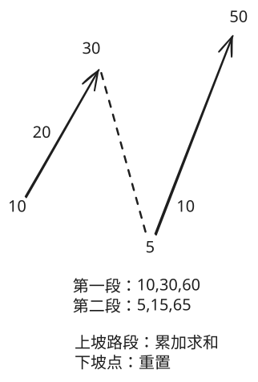

## 1. 📝 题目描述

- [leetcode](https://leetcode.cn/problems/maximum-ascending-subarray-sum/)

给你一个正整数组成的数组 `nums`，返回 `nums` 中一个严格递增子数组的最大可能元素和。

> - 严格递增数组
> - 若数组的每一个元素都严格大于其前一个元素，那么称该数组严格递增。

子数组是数组中的一个连续数字序列。

---

示例 1：

```txt
输入：nums = [10,20,30,5,10,50]
输出：65

解释：
[5,10,50] 是元素和最大的升序子数组，最大元素和为 65。
```

---

示例 2：

```txt
输入：nums = [10,20,30,40,50]
输出：150

解释：
[10,20,30,40,50] 是元素和最大的升序子数组，最大元素和为 150。
```

---

示例 3：

```txt
输入：nums = [12,17,15,13,10,11,12]
输出：33

解释：
[10,11,12] 是元素和最大的升序子数组，最大元素和为 33。
```

---

提示：

- `1 <= nums.length <= 100`
- `1 <= nums[i] <= 100`

## 2. 🎯 s.1 - 暴力解法



::: code-group

```js [js]
/**
 * @param {number[]} nums
 * @return {number}
 */
var maxAscendingSum = function (nums) {
  let cur = nums[0]
  let best = nums[0]

  for (let i = 1; i < nums.length; i += 1) {
    if (nums[i] > nums[i - 1]) cur += nums[i]
    else cur = nums[i]

    if (cur > best) best = cur
  }

  return best
}
```

:::

- 时间复杂度：$O(N)$，其中 N 是数组 nums 的长度
- 空间复杂度：$O(1)$，只使用常数额外空间

算法思路：

- 初始化 `cur` 和 `best` 为数组首元素，分别记录当前升序段和与全局最大和
- 从第二个元素开始遍历数组：
  - 若当前元素严格大于前一个元素，将其累加到 `cur`
  - 否则说明升序段中断，重置 `cur` 为当前元素
- 每次更新 `cur` 后，同步更新全局最大和 `best`
