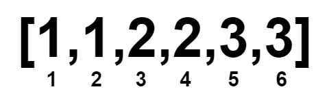

## 1. 📝 题目描述

- [leetcode](https://leetcode.cn/problems/minimum-array-length-after-pair-removals/)

给你一个下标从 0 开始的 非递减 整数数组 `nums`。

你可以执行以下操作任意次：

- 选择 两个 下标 `i` 和 `j`，满足 `nums[i] < nums[j]`。
- 将 `nums` 中下标在 `i` 和 `j` 处的元素删除。剩余元素按照原来的顺序组成新的数组，下标也重新从 0 开始编号。

请你返回一个整数，表示执行以上操作任意次后（可以执行 0 次），`nums` 数组的 最小 数组长度。

---

示例 1：

```txt
输入：nums = [1,2,3,4]
输出：0
```

- 解释：
  - 

示例 2：

```txt
输入：nums = [1,1,2,2,3,3]
输出：0
```

- 解释：
  - 

示例 3：

```txt
输入：nums = [1000000000,1000000000]
输出：2

解释：
由于两个数字相等，不能删除它们。
```

示例 4：

```txt
输入：nums = [2,3,4,4,4]
输出：1
```

- 解释：
  - 

---

提示：

- `1 <= nums.length <= 10^5`
- `1 <= nums[i] <= 10^9`
- `nums` 是 非递减 数组。

## 2. 🎯 s.1 - 众数判断

::: code-group

```js [js]
/**
 * @param {number[]} nums
 * @return {number}
 */
var minLengthAfterRemovals = function(nums) {
  const n = nums.length
  const mid = nums[n >> 1]
  let lo = 0, hi = n
  while (lo < hi) { const m = (lo + hi) >> 1; if (nums[m] < mid) lo = m + 1; else hi = m }
  const left = lo
  lo = 0; hi = n
  while (lo < hi) { const m = (lo + hi) >> 1; if (nums[m] <= mid) lo = m + 1; else hi = m }
  const freq = lo - left
  return freq > (n >> 1) ? 2 * freq - n : n % 2
}
```

```c [c]
int minLengthAfterRemovals(int* nums, int numsSize) {
    int mid = nums[numsSize / 2];
    int lo = 0, hi = numsSize, m;
    while (lo < hi) { m = (lo + hi) / 2; if (nums[m] < mid) lo = m + 1; else hi = m; }
    int left = lo;
    lo = 0; hi = numsSize;
    while (lo < hi) { m = (lo + hi) / 2; if (nums[m] <= mid) lo = m + 1; else hi = m; }
    int freq = lo - left;
    return freq > numsSize / 2 ? 2 * freq - numsSize : numsSize % 2;
}
```

```py [py]
class Solution:
    def minLengthAfterRemovals(self, nums: List[int]) -> int:
        n = len(nums)
        mid = nums[n // 2]
        freq = bisect_right(nums, mid) - bisect_left(nums, mid)
        return 2 * freq - n if freq > n // 2 else n % 2
```

:::

- 时间复杂度：$O(N)$，二分查找众数频率（数组已排序）
- 空间复杂度：$O(1)$，只使用常数额外空间

算法思路：

- 对已排序数组，中间元素 nums[n/2] 就是可能的众数
- 用二分查找统计其频率 freq
- 若 freq > n/2，则有 2*freq - n 个元素无法配对；否则所有元素都能配对，答案为 n % 2
