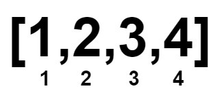
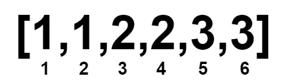
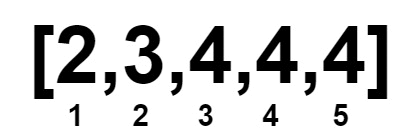

# [2856. 删除数对后的最小数组长度【中等】](https://github.com/tnotesjs/TNotes.leetcode/tree/main/notes/2856.%20%E5%88%A0%E9%99%A4%E6%95%B0%E5%AF%B9%E5%90%8E%E7%9A%84%E6%9C%80%E5%B0%8F%E6%95%B0%E7%BB%84%E9%95%BF%E5%BA%A6%E3%80%90%E4%B8%AD%E7%AD%89%E3%80%91)

<!-- region:toc -->

- [1. 📝 题目描述](#1--题目描述)
- [2. 🎯 s.1 - 解法 1](#2--s1---解法-1)

<!-- endregion:toc -->

## 1. 📝 题目描述

- [leetcode](https://leetcode.cn/problems/minimum-array-length-after-pair-removals/)

给你一个下标从 0 开始的 非递减 整数数组 `nums`。

你可以执行以下操作任意次：

- 选择 两个 下标 `i` 和 `j`，满足 `nums[i] < nums[j]`。
- 将 `nums` 中下标在 `i` 和 `j` 处的元素删除。剩余元素按照原来的顺序组成新的数组，下标也重新从 0 开始编号。

请你返回一个整数，表示执行以上操作任意次后（可以执行 0 次），`nums` 数组的 最小 数组长度。

---

示例 1：

```txt
输入：nums = [1,2,3,4]
输出：0
```

- 解释：
  - 

示例 2：

```txt
输入：nums = [1,1,2,2,3,3]
输出：0
```

- 解释：
  - 

示例 3：

```txt
输入：nums = [1000000000,1000000000]
输出：2

解释：
由于两个数字相等，不能删除它们。
```

示例 4：

```txt
输入：nums = [2,3,4,4,4]
输出：1
```

- 解释：
  - 

---

提示：

- `1 <= nums.length <= 10^5`
- `1 <= nums[i] <= 10^9`
- `nums` 是 非递减 数组。

## 2. 🎯 s.1 - 众数判断

::: code-group

<<< ./solutions/1/1.js [js]
<<< ./solutions/1/1.c [c]
<<< ./solutions/1/1.py [py]

:::

- 时间复杂度：$O(N)$，二分查找众数频率（数组已排序）
- 空间复杂度：$O(1)$，只使用常数额外空间

算法思路：

- 对已排序数组，中间元素 nums[n/2] 就是可能的众数
- 用二分查找统计其频率 freq
- 若 freq > n/2，则有 2*freq - n 个元素无法配对；否则所有元素都能配对，答案为 n % 2
