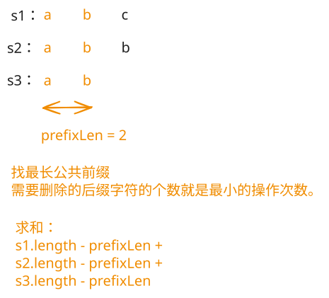

## 1. 📝 题目描述

- [leetcode](https://leetcode.cn/problems/make-three-strings-equal/)

给你三个字符串 `s1`、`s2` 和 `s3`。你可以根据需要对这三个字符串执行以下操作任意次数。

在每次操作中，你可以选择其中一个长度至少为 `2` 的字符串并删除其最右位置上的字符。

如果存在某种方法能够使这三个字符串相等，请返回使它们相等所需的最小操作次数；否则，返回 `-1`。

---

示例 1：

```txt
输入：s1 = "abc"，s2 = "abb"，s3 = "ab"
输出：2
```

解释：

- 对 s1 和 s2 进行一次操作后，可以得到三个相等的字符串。
- 可以证明，不可能用少于两次操作使它们相等。

---

示例 2：

```txt
输入：s1 = "dac"，s2 = "bac"，s3 = "cac"
输出：-1
```

解释：

- 因为 s1 和 s2 的最左位置上的字母不相等，所以无论进行多少次操作，它们都不可能相等。
- 因此答案是 -1。

---

提示：

- `1 <= s1.length, s2.length, s3.length <= 100`
- `s1`、`s2` 和 `s3` 仅由小写英文字母组成。

## 2. 🎯 s.1 - 公共前缀



::: code-group

```js [js]
/**
 * @param {string} s1
 * @param {string} s2
 * @param {string} s3
 * @return {number}
 */
var findMinimumOperations = function (s1, s2, s3) {
  // 找到三个字符串的最长公共前缀长度
  const minLen = Math.min(s1.length, s2.length, s3.length)
  let prefixLen = 0
  for (let i = 0; i < minLen; i++) {
    if (s1[i] === s2[i] && s2[i] === s3[i]) {
      prefixLen++
    } else {
      break
    }
  }
  // 如果没有公共前缀，无法使三个字符串相等
  if (prefixLen === 0) return -1

  // 操作次数 = 各字符串需要删除的字符数之和
  const s1Operations = s1.length - prefixLen
  const s2Operations = s2.length - prefixLen
  const s3Operations = s3.length - prefixLen
  return s1Operations + s2Operations + s3Operations
}
```

:::

- 时间复杂度：$O(\min(n_1, n_2, n_3))$，其中 $n_1$, $n_2$, $n_3$ 分别是三个字符串的长度
- 空间复杂度：$O(1)$，只使用了常数级别的额外空间

算法思路：

- 由于只能删除最右边的字符，最终相等的字符串一定是三个字符串的公共前缀
- 找到三个字符串的最长公共前缀长度 len
- 如果 len 为 0，说明无法使三个字符串相等，返回 -1
- 否则答案为各字符串需要删除的字符数之和
