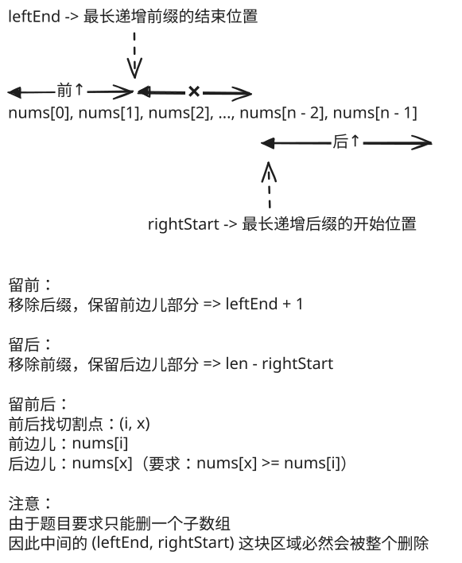

## 1. 📝 题目描述

- [leetcode](https://leetcode.cn/problems/count-the-number-of-incremovable-subarrays-i/)

给你一个下标从 0 开始的正整数数组 `nums`。

如果 `nums` 的一个子数组满足：移除这个子数组后剩余元素严格递增，那么我们称这个子数组为移除递增子数组。比方说，`[5, 3, 4, 6, 7]` 中的 `[3, 4]` 是一个移除递增子数组，因为移除该子数组后，`[5, 3, 4, 6, 7]` 变为 `[5, 6, 7]`，是严格递增的。

请你返回 `nums` 中移除递增子数组的总数目。

注意，剩余元素为空的数组也视为是递增的。

子数组指的是一个数组中一段非空且连续的元素序列。

---

示例 1：

```txt
输入：nums = [1,2,3,4]
输出：10
```

解释：

- 10 个移除递增子数组分别为：`[1]`, `[2]`, `[3]`, `[4]`, `[1,2]`, `[2,3]`, `[3,4]`, `[1,2,3]`, `[2,3,4]` 和 `[1,2,3,4]`。
- 移除任意一个子数组后，剩余元素都是递增的。注意，空数组不是移除递增子数组。

---

示例 2：

```txt
输入：nums = [6,5,7,8]
输出：7
```

解释：

- 7 个移除递增子数组分别为：`[5]`, `[6]`, `[5,7]`, `[6,5]`, `[5,7,8]`, `[6,5,7]` 和 `[6,5,7,8]`。
- nums 中只有这 7 个移除递增子数组。

---

示例 3：

```txt
输入：nums = [8,7,6,6]
输出：3
```

解释：

- 3 个移除递增子数组分别为：`[8,7,6]`, `[7,6,6]` 和 `[8,7,6,6]`。
- 注意 `[8,7]` 不是移除递增子数组因为移除 `[8,7]` 后 nums 变为 `[6,6]`，它不是严格递增的。

---

提示：

- `1 <= nums.length <= 50`
- `1 <= nums[i] <= 50`

## 2. 🎯 s.1 - 暴力枚举

::: code-group

```js [js]
/**
 * @param {number[]} nums
 * @return {number}
 */
var incremovableSubarrayCount = function (nums) {
  const n = nums.length
  let count = 0

  // 检查数组是否严格递增
  const isStrictlyIncreasing = (arr) => {
    for (let i = 1; i < arr.length; i++) {
      if (arr[i] <= arr[i - 1]) return false
    }
    return true
  }

  // 枚举所有子数组 [i, j]
  for (let i = 0; i < n; i++) {
    for (let j = i; j < n; j++) {
      // 移除 [i, j] 后的剩余数组
      const remaining = [...nums.slice(0, i), ...nums.slice(j + 1)]

      // 检查剩余数组是否严格递增
      if (isStrictlyIncreasing(remaining)) count++
    }
  }
  return count
}
```

:::

- 时间复杂度：$O(n^3)$，枚举所有子数组 $O(n^2)$，检查剩余数组是否递增 $O(n)$
- 空间复杂度：$O(n)$，用于存储剩余数组

算法思路：

- 枚举所有可能的子数组 `[i, j]`，其中 `0 <= i <= j < n`
- 对于每个子数组，移除后检查剩余元素是否严格递增
- 统计满足条件的子数组数目

## 3. 🎯 s.2 - 前缀后缀结合 + 二分查找



::: code-group

```js [js]
/**
 * @param {number[]} nums
 * @return {number}
 */
var incremovableSubarrayCount = function (nums) {
  const n = nums.length

  // 找最长递增前缀的结束位置
  let leftEnd = 0
  while (leftEnd + 1 < n && nums[leftEnd] < nums[leftEnd + 1]) leftEnd++

  // 如果整个数组都是递增的，所有子数组都可以移除
  if (leftEnd === n - 1) return (n * (n + 1)) / 2

  // 找最长递增后缀的开始位置
  let rightStart = n - 1
  while (rightStart > 0 && nums[rightStart - 1] < nums[rightStart]) rightStart--

  let result = 0

  result += leftEnd + 1 // 移除后缀，保留前面部分
  result += n - rightStart // 移除前缀，保留后面部分
  result += 1 // 全部移除

  // 移除中间部分，连接前缀和后缀
  // 对于前缀中的每个位置 i，找到后缀 [rightStart, n-1] 中第一个 nums[l] > nums[i] 的位置
  for (let i = 0; i <= leftEnd; i++) {
    let l = rightStart,
      r = n
    while (l < r) {
      let mid = Math.floor((l + r) / 2)
      if (nums[mid] > nums[i]) r = mid
      else l = mid + 1
    }
    // 从 l 到 n-1 的所有位置都可以与位置 i 连接
    result += n - l
  }

  return result
}
```

:::

- 时间复杂度：$O(N \log N)$，找前缀后缀 $O(N)$，枚举前缀并二分查找后缀 $O(N \log N)$
- 空间复杂度：$O(1)$，只使用常数额外空间

算法思路：

- 预处理找出最长递增前缀 `[0, leftEnd]` 和最长递增后缀 `[rightStart, n-1]`
- 如果整个数组递增，任意子数组都可移除，返回 $\frac{N \times (N+1)}{2}$
- 否则分三类统计：
  1. 只保留前缀：移除 `[i, n-1]`，共 `leftEnd + 1` 种
  2. 只保留后缀：移除 `[0, j]`，共 `n - rightStart` 种
  3. 移除全部：共 1 种
  4. 保留前缀和后缀：枚举前缀位置 `i`，二分查找后缀中第一个大于 `nums[i]` 的位置 `l`，可以连接 `[l, n-1]` 中任意位置
