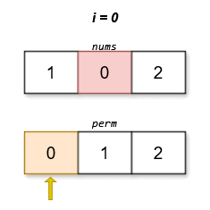
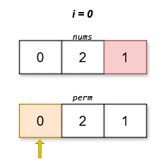

## 1. 📝 题目描述

- [leetcode](https://leetcode.cn/problems/find-the-minimum-cost-array-permutation/)

给你一个数组 `nums`，它是 `[0, 1, 2, ..., n - 1]` 的一个排列。对于任意一个 `[0, 1, 2, ..., n - 1]` 的排列 `perm`，其 分数 定义为：

`score(perm) = |perm[0] - nums[perm[1]]| + |perm[1] - nums[perm[2]]| + ... + |perm[n - 1] - nums[perm[0]]|`

返回具有 最低 分数的排列 `perm`。如果存在多个满足题意且分数相等的排列，则返回其中字典序最小的一个。

---

示例 1：

输入：nums = [1,0,2]

输出：[0,1,2]

解释：



字典序最小且分数最低的排列是 `[0,1,2]`。这个排列的分数是 `|0 - 0| + |1 - 2| + |2 - 1| = 2`。

---

示例 2：

输入：nums = [0,2,1]

输出：[0,2,1]

解释：



字典序最小且分数最低的排列是 `[0,2,1]`。这个排列的分数是 `|0 - 1| + |2 - 2| + |1 - 0| = 2`。

---

提示：

- `2 <= n == nums.length <= 14`
- `nums` 是 `[0, 1, 2, ..., n - 1]` 的一个排列。

## 2. 🎯 s.1 - 解法 1

::: code-group

```js [js]
// todo
```

:::

- 时间复杂度：$O(1)$
- 空间复杂度：$O(1)$
