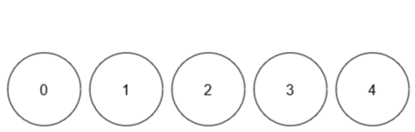

# [3160. 所有球里面不同颜色的数目【中等】](https://github.com/tnotesjs/TNotes.leetcode/tree/main/notes/3160.%20%E6%89%80%E6%9C%89%E7%90%83%E9%87%8C%E9%9D%A2%E4%B8%8D%E5%90%8C%E9%A2%9C%E8%89%B2%E7%9A%84%E6%95%B0%E7%9B%AE%E3%80%90%E4%B8%AD%E7%AD%89%E3%80%91)

<!-- region:toc -->

- [1. 📝 题目描述](#1--题目描述)
- [2. 🎯 s.1 - 解法 1](#2--s1---解法-1)

<!-- endregion:toc -->

## 1. 📝 题目描述

- [leetcode](https://leetcode.cn/problems/find-the-number-of-distinct-colors-among-the-balls/)

给你一个整数 `limit` 和一个大小为 `n x 2` 的二维数组 `queries`。

总共有 `limit + 1` 个球，每个球的编号为 `[0, limit]` 中一个 互不相同 的数字。一开始，所有球都没有颜色。`queries` 中每次操作的格式为 `[x, y]` ，你需要将球 `x` 染上颜色 `y`。每次操作之后，你需要求出所有球颜色的数目。

请你返回一个长度为 `n` 的数组 `result` ，其中 `result[i]` 是第 `i` 次操作以后颜色的数目。

注意 ，没有染色的球不算作一种颜色。

---

示例 1：

输入：limit = 4, queries = [[1,4],[2,5],[1,3],[3,4]]

输出：[1,2,2,3]

解释：

- 操作 0 后，球 1 颜色为 4。
- 操作 1 后，球 1 颜色为 4 ，球 2 颜色为 5。
- 操作 2 后，球 1 颜色为 3 ，球 2 颜色为 5。
- 操作 3 后，球 1 颜色为 3 ，球 2 颜色为 5 ，球 3 颜色为 4。

---

示例 2：

输入：limit = 4, queries = [[0,1],[1,2],[2,2],[3,4],[4,5]]

输出：[1,2,2,3,4]

解释：

- 操作 0 后，球 0 颜色为 1。
- 操作 1 后，球 0 颜色为 1 ，球 1 颜色为 2。
- 操作 2 后，球 0 颜色为 1 ，球 1 和 2 颜色为 2。
- 操作 3 后，球 0 颜色为 1 ，球 1 和 2 颜色为 2 ，球 3 颜色为 4。
- 操作 4 后，球 0 颜色为 1 ，球 1 和 2 颜色为 2 ，球 3 颜色为 4 ，球 4 颜色为 5。

---

提示：

- `1 <= limit <= 10^9`
- `1 <= n == queries.length <= 10^5`
- `queries[i].length == 2`
- `0 <= queries[i][0] <= limit`
- `1 <= queries[i][1] <= 10^9`

## 2. 🎯 s.1 - 解法 1

::: code-group

<<< ./solutions/1/1.js [js]

:::

- 时间复杂度：$O(1)$
- 空间复杂度：$O(1)$
