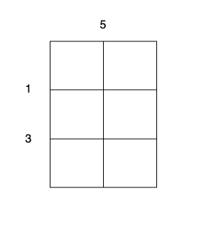

# [3219. 切蛋糕的最小总开销 II【困难】](https://github.com/tnotesjs/TNotes.leetcode/tree/main/notes/3219.%20%E5%88%87%E8%9B%8B%E7%B3%95%E7%9A%84%E6%9C%80%E5%B0%8F%E6%80%BB%E5%BC%80%E9%94%80%20II%E3%80%90%E5%9B%B0%E9%9A%BE%E3%80%91)

<!-- region:toc -->

- [1. 📝 题目描述](#1--题目描述)
- [2. 🎯 s.1 - 解法 1](#2--s1---解法-1)
- [3. 🎯 s.2 - 解法 2](#3--s2---解法-2)
- [4. 🎯 s.3 - 解法 3](#4--s3---解法-3)

<!-- endregion:toc -->

## 1. 📝 题目描述

- [leetcode](https://leetcode.cn/problems/minimum-cost-for-cutting-cake-ii/)

有一个 `m x n` 大小的矩形蛋糕，需要切成 `1 x 1` 的小块。

给你整数 `m` ，`n` 和两个数组：

- `horizontalCut` 的大小为 `m - 1` ，其中 `horizontalCut[i]` 表示沿着水平线 `i` 切蛋糕的开销。
- `verticalCut` 的大小为 `n - 1` ，其中 `verticalCut[j]` 表示沿着垂直线 `j` 切蛋糕的开销。

一次操作中，你可以选择任意不是 `1 x 1` 大小的矩形蛋糕并执行以下操作之一：

1.  沿着水平线 `i` 切开蛋糕，开销为 `horizontalCut[i]` 。
2.  沿着垂直线 `j` 切开蛋糕，开销为 `verticalCut[j]` 。

每次操作后，这块蛋糕都被切成两个独立的小蛋糕。

每次操作的开销都为最开始对应切割线的开销，并且不会改变。

请你返回将蛋糕全部切成 `1 x 1` 的蛋糕块的 最小 总开销。

---

- 示例 1：

输入： m = 3, n = 2, horizontalCut = [1,3], verticalCut = [5]

输出： 13

解释：

- 沿着垂直线 0 切开蛋糕，开销为 5 。
- 沿着水平线 0 切开 `3 x 1` 的蛋糕块，开销为 1 。
- 沿着水平线 0 切开 `3 x 1` 的蛋糕块，开销为 1 。
- 沿着水平线 1 切开 `2 x 1` 的蛋糕块，开销为 3 。
- 沿着水平线 1 切开 `2 x 1` 的蛋糕块，开销为 3 。

总开销为 `5 + 1 + 1 + 3 + 3 = 13` 。

---

- 示例 2：

输入： m = 2, n = 2, horizontalCut = [7], verticalCut = [4]

输出： 15

解释：

- 沿着水平线 0 切开蛋糕，开销为 7 。
- 沿着垂直线 0 切开 `1 x 2` 的蛋糕块，开销为 4 。
- 沿着垂直线 0 切开 `1 x 2` 的蛋糕块，开销为 4 。

总开销为 `7 + 4 + 4 = 15` 。

---

提示：

- `1 <= m, n <= 10^5`
- `horizontalCut.length == m - 1`
- `verticalCut.length == n - 1`
- `1 <= horizontalCut[i], verticalCut[i] <= 10^3`

## 2. 🎯 s.1 - 解法 1

::: code-group

<<< ./solutions/1/1.js [js]

:::

- 时间复杂度：$O(1)$
- 空间复杂度：$O(1)$

## 3. 🎯 s.2 - 解法 2

::: code-group

<<< ./solutions/2/1.js [js]

:::

- 时间复杂度：$O(1)$
- 空间复杂度：$O(1)$

## 4. 🎯 s.3 - 解法 3

::: code-group

<<< ./solutions/3/1.js [js]

:::

- 时间复杂度：$O(1)$
- 空间复杂度：$O(1)$
