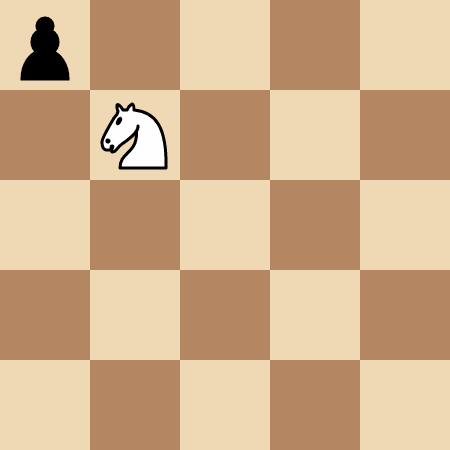

# [3283. 吃掉所有兵需要的最多移动次数【困难】](https://github.com/tnotesjs/TNotes.leetcode/tree/main/notes/3283.%20%E5%90%83%E6%8E%89%E6%89%80%E6%9C%89%E5%85%B5%E9%9C%80%E8%A6%81%E7%9A%84%E6%9C%80%E5%A4%9A%E7%A7%BB%E5%8A%A8%E6%AC%A1%E6%95%B0%E3%80%90%E5%9B%B0%E9%9A%BE%E3%80%91)

<!-- region:toc -->

- [1. 📝 题目描述](#1--题目描述)
- [2. 🎯 s.1 - 解法 1](#2--s1---解法-1)
- [3. 🎯 s.2 - 解法 2](#3--s2---解法-2)
- [4. 🎯 s.3 - 解法 3](#4--s3---解法-3)

<!-- endregion:toc -->

## 1. 📝 题目描述

- [leetcode](https://leetcode.cn/problems/maximum-number-of-moves-to-kill-all-pawns/)

给你一个 `50 x 50` 的国际象棋棋盘，棋盘上有 一个 马和一些兵。给你两个整数 `kx` 和 `ky` ，其中 `(kx, ky)` 表示马所在的位置，同时还有一个二维数组 `positions` ，其中 `positions[i] = [xi, yi]` 表示第 `i` 个兵在棋盘上的位置。

Alice 和 Bob 玩一个回合制游戏，Alice 先手。玩家的一次操作中，可以执行以下操作：

- 玩家选择一个仍然在棋盘上的兵，然后移动马，通过 最少 的 步数 吃掉这个兵。注意 ，玩家可以选择 任意 一个兵，不一定 要选择从马的位置出发 最少 移动步数的兵。
- 在马吃兵的过程中，马 可能 会经过一些其他兵的位置，但这些兵 不会 被吃掉。只有 选中的兵在这个回合中被吃掉。

Alice 的目标是 最大化 两名玩家的 总 移动次数，直到棋盘上不再存在兵，而 Bob 的目标是 最小化 总移动次数。

假设两名玩家都采用 最优 策略，请你返回可以达到的 最大 总移动次数。

在一次 移动 中，如下图所示，马有 8 个可以移动到的位置，每个移动位置都是沿着坐标轴的一个方向前进 2 格，然后沿着垂直的方向前进 1 格。

---

- 示例 1：

输入： kx = 1, ky = 1, positions = [[0,0]]

输出： 4

解释：

马需要移动 4 步吃掉 `(0, 0)` 处的兵。

---

- 示例 2：

输入： kx = 0, ky = 2, positions = [[1,1],[2,2],[3,3]]

输出： 8

解释：

- Alice 选择 `(2, 2)` 处的兵，移动马吃掉它需要 2 步：`(0, 2) -> (1, 4) -> (2, 2)` 。
- Bob 选择 `(3, 3)` 处的兵，移动马吃掉它需要 2 步：`(2, 2) -> (4, 1) -> (3, 3)` 。
- Alice 选择 `(1, 1)` 处的兵，移动马吃掉它需要 4 步：`(3, 3) -> (4, 1) -> (2, 2) -> (0, 3) -> (1, 1)` 。

---

- 示例 3：

输入： kx = 0, ky = 0, positions = [[1,2],[2,4]]

输出： 3

解释：

- Alice 选择 `(2, 4)` 处的兵，移动马吃掉它需要 2 步：`(0, 0) -> (1, 2) -> (2, 4)` 。注意，`(1, 2)` 处的兵不会被吃掉。
- Bob 选择 `(1, 2)` 处的兵，移动马吃掉它需要 1 步：`(2, 4) -> (1, 2)` 。

---

提示：

- `0 <= kx, ky <= 49`
- `1 <= positions.length <= 15`
- `positions[i].length == 2`
- `0 <= positions[i][0], positions[i][1] <= 49`
- `positions[i]` 两两互不相同。
- 输入保证对于所有 `0 <= i < positions.length` ，都有 `positions[i] != [kx, ky]` 。

## 2. 🎯 s.1 - 解法 1

::: code-group

<<< ./solutions/1/1.js [js]

:::

- 时间复杂度：$O(1)$
- 空间复杂度：$O(1)$

## 3. 🎯 s.2 - 解法 2

::: code-group

<<< ./solutions/2/1.js [js]

:::

- 时间复杂度：$O(1)$
- 空间复杂度：$O(1)$

## 4. 🎯 s.3 - 解法 3

::: code-group

<<< ./solutions/3/1.js [js]

:::

- 时间复杂度：$O(1)$
- 空间复杂度：$O(1)$
